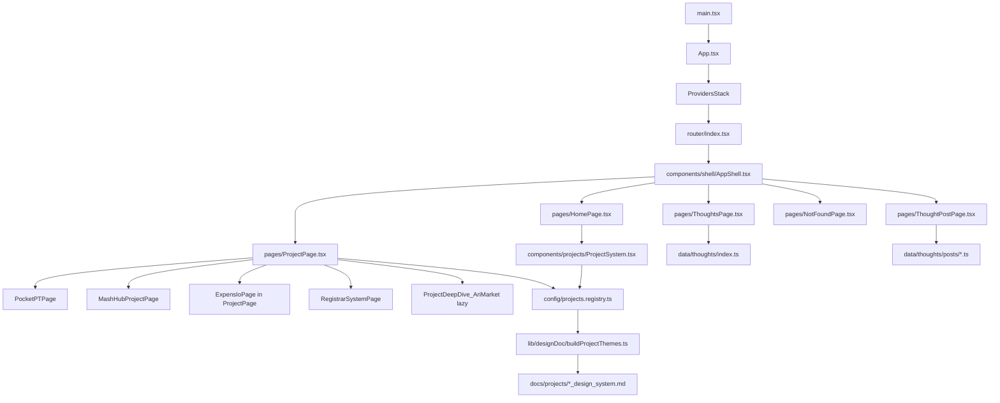

# Portfolio frontend — LLM context guide

Single reference for the **Yuri Brown** portfolio web app: stack, routing, design/layout settings, page structure, component inventory, and major feature pipelines.

**Path convention:** This file lives in [`docs/`](./). Links to app source use [`../yuri-portfolio/…`](../yuri-portfolio/); design-system Markdown inputs use [`projects/`](./projects/) (same `docs` folder).

**Primary application:** [`yuri-portfolio/`](../yuri-portfolio/) — **Vite + React 19 + TypeScript + React Router v6 + Tailwind CSS v4** (via `@tailwindcss/vite`). **Not** Next.js.

---

## Table of contents

1. [Architecture overview](#1-architecture-overview)
2. [Design and layout settings](#2-design-and-layout-settings)
3. [Routing and shells](#3-routing-and-shells)
4. [Pages, sections, and components](#4-pages-sections-and-components)
5. [Significant features](#5-significant-features)
6. [Where to edit (quick index)](#6-where-to-edit-quick-index)

Within §4: [Project case study routes](#project-case-study-routes) (`/projects/:slug`)

Within §2: [Motion and accessibility](#motion-and-accessibility) · [Per-project accent themes](#per-project-accent-themes-runtime) · [Shell layout and navigation](#shell-layout-and-navigation) · [Metadata / SEO](#metadata--seo) · [Accessibility (shell)](#accessibility-shell) · [Theme and view context modules](#theme-and-view-context-modules)

---

## 1. Architecture overview

### Boot sequence

| Step | File | Role |
|------|------|------|
| HTML shell | [`yuri-portfolio/index.html`](../yuri-portfolio/index.html) | Title, viewport, favicon, Google Fonts (Space Grotesk, JetBrains Mono, DM Sans) |
| JS entry | [`yuri-portfolio/src/main.tsx`](../yuri-portfolio/src/main.tsx) | Imports global CSS (`design-system.css`, Lenis CSS, `index.css`), mounts `<App />` under `StrictMode` |
| App root | [`yuri-portfolio/src/App.tsx`](../yuri-portfolio/src/App.tsx) | Wraps router with providers |
| Routing | [`yuri-portfolio/src/router/index.tsx`](../yuri-portfolio/src/router/index.tsx) | `createBrowserRouter` + `RouterProvider` (`future.v7_startTransition`) |
| Layout | [`yuri-portfolio/src/components/shell/AppShell.tsx`](../yuri-portfolio/src/components/shell/AppShell.tsx) | Header, overlays, `<Outlet />` for nested routes |

### Provider order (outside to inside)

[`App.tsx`](../yuri-portfolio/src/App.tsx):

1. **TechnicalViewProvider** — persisted “technical view” toggle (`localStorage` key `yuri-portfolio-technical-view`).
2. **ThemeAccentProvider** — animates global CSS accent variables based on scroll-intersected project; exposes `activeProjectId` / `setActiveProjectId`.
3. **ReducedMotionBridge** — calls [`usePrefersReducedMotion`](../yuri-portfolio/src/app/providers/usePrefersReducedMotion.ts) once at root. In current [`App.tsx`](../yuri-portfolio/src/App.tsx) it is **self-closing** (no `children`), so it renders **nothing** but still subscribes to `matchMedia('(prefers-reduced-motion: reduce)')`. The component accepts optional `children` for future wiring ([`ReducedMotionBridge.tsx`](../yuri-portfolio/src/app/providers/ReducedMotionBridge.tsx) comment: placeholder for shared context).
4. **ScrollRoot** — initializes **Lenis** smooth wheel scrolling when motion is **not** reduced. **Sibling** of the bridge, not wrapped by it.

### High-level dependency flow

### Build tooling

- [`yuri-portfolio/vite.config.ts`](../yuri-portfolio/vite.config.ts): `@tailwindcss/vite`, `@vitejs/plugin-react`, alias `@` → `src`, `server.fs.allow` includes repo parent (for importing root `docs` as raw Markdown in Vite).

### Key dependencies (behavioral)

See [`yuri-portfolio/package.json`](../yuri-portfolio/package.json): `framer-motion`, `lenis`, `react-router-dom`, `recharts`, `@xyflow/react`, `reading-time`, `date-fns`, GSAP/Radix where used in subtree components.

---

## 2. Design and layout settings

### Dual token layers (important for LLMs)

Two global stylesheets both define typography/colors/layout behavior:

| File | Responsibility |
|------|----------------|
| [`yuri-portfolio/src/styles/design-system.css`](../yuri-portfolio/src/styles/design-system.css) | Canonical **semantic** palette (`--color-bg-base`, `--color-text-primary`, `--color-accent-*`, borders), **Space Grotesk / DM Sans / JetBrains Mono**, spacing scale `--space-*`, radii `--radius-*`, shadows, **easing/duration** (`--ease-out-expo`, `--duration-*`), **breakpoints as CSS vars** `--bp-*`, **layout rhythm** (`--shell-content-max-width`, `--section-vertical-rhythm*`), **z-index scale** (`--z-nav`, `--z-content`, etc.), base `body` styles, **grain/noise overlay** on `body::before` |
| [`yuri-portfolio/src/index.css`](../yuri-portfolio/src/index.css) | Tailwind v4 **`@theme`** (minimal palette + `--font-sans`/mono); **`:root`** “global shell” vars (`--global-bg`, `--global-text`, `--accent-primary`, chart colors `--chart-a`–`d`, `--radius-project`, `--density-gap`, **shell gutters** `--shell-gutter-*`, `--shell-header-height`); **`html`** `scroll-behavior: smooth` overridden to **`auto`** under `prefers-reduced-motion`; base `body`/`#root` min-height |

Components mix **`--color-*`** (design-system) and **`--global-*`** / **`--accent-*`** (ThemeAccentProvider + index). When theming, expect both naming schemes in class `style`/Tailwind arbitrary values.

### Motion and accessibility

| Concern | Source |
|---------|--------|
| `prefers-reduced-motion` | [`usePrefersReducedMotion`](../yuri-portfolio/src/app/providers/usePrefersReducedMotion.ts); root [`ReducedMotionBridge`](../yuri-portfolio/src/app/providers/ReducedMotionBridge.tsx) |
| Lenis smooth scroll | [`ScrollRoot.tsx`](../yuri-portfolio/src/app/providers/ScrollRoot.tsx); disabled when reduced motion |
| Section reveals | [`Section.tsx`](../yuri-portfolio/src/components/shell/Section.tsx) — `framer-motion` `whileInView` + [`fadeInUp`](../yuri-portfolio/src/lib/motion/presets.ts); skipped when reduced motion |
| Route transitions | [`PageTransition.tsx`](../yuri-portfolio/src/components/ui/PageTransition.tsx) — full-screen wipe + route label; bypassed when reduced motion |
| Theme var transitions | [`ThemeAccentProvider.tsx`](../yuri-portfolio/src/app/providers/ThemeAccentProvider.tsx) — `motion.div` animates CSS variables; `duration: 0` when reduced motion |

Shared motion presets: [`yuri-portfolio/src/lib/motion/presets.ts`](../yuri-portfolio/src/lib/motion/presets.ts) (`motionEase`, `fadeInUp`, `staggerChildren`).

### Per-project accent themes (runtime)

- **Intersection-driven:** [`ProjectModule`](../yuri-portfolio/src/components/projects/ProjectModule.tsx) uses `IntersectionObserver` on the project root; when a card crosses thresholds, calls `setActiveProjectId(project.id)`.
- **Theme bundles:** [`buildProjectThemes.ts`](../yuri-portfolio/src/lib/designDoc/buildProjectThemes.ts) merges:
  - Parsed Markdown design docs → [`parseDesignDoc.ts`](../yuri-portfolio/src/lib/designDoc/parseDesignDoc.ts)
  - Hardcoded **`registryOverrides`** per `ProjectId` (accent hex, density, radius, chart colors)
  - Output CSS via [`mergeTheme.ts`](../yuri-portfolio/src/lib/designDoc/mergeTheme.ts) → `themeToCssVars` maps to `--accent-primary`, `--accent-secondary`, `--surface-tint`, `--chart-a`–`d`, **`--radius-project`**, **`--density-gap`**.
- **Raw Markdown inputs:** [`importDocs.ts`](../yuri-portfolio/src/lib/designDoc/importDocs.ts) imports **`?raw`** from [`docs/projects/*_design_system.md`](projects/) (repo-root `docs`, not duplicated under `yuri-portfolio`).

**Global fallback accents** (no active project): [`ThemeAccentProvider`](../yuri-portfolio/src/app/providers/ThemeAccentProvider.tsx) `globalAccentVars` object.

### Shell layout and navigation

| Setting / behavior | Source |
|--------------------|--------|
| Max content width, horizontal padding | CSS vars `--shell-content-max-width`, `--shell-gutter-sm/md/lg`; applied in [`AppShell`](../yuri-portfolio/src/components/shell/AppShell.tsx) content wrapper |
| Fixed header height / scroll padding for sections | `--shell-header-height`; [`Section`](../yuri-portfolio/src/components/shell/Section.tsx) `scroll-mt-[calc(var(--shell-header-height)+…)]` |
| Header solid on scroll | [`AppShell`](../yuri-portfolio/src/components/shell/AppShell.tsx) — `useScroll` / `useMotionValueEvent`; blur + border after `scrollY > 60` |
| Section map (home only, xl+) | [`NAV_SECTIONS`](../yuri-portfolio/src/config/navigation.ts) — ids must match DOM `id` on sections ; [`useActiveSection`](../yuri-portfolio/src/hooks/useActiveSection.ts) `IntersectionObserver` with `rootMargin: '-40% 0px -45% 0px'` |

**Nav sections (home anchors):**

| DOM `id` | Label (short) | Primary content |
|----------|-----------------|----------------|
| `hero` | Entry (01) | [`HeroSystemEntry`](../yuri-portfolio/src/components/hero/HeroSystemEntry.tsx) |
| `system-overview` | System Overview (02) | [`SystemOverview`](../yuri-portfolio/src/components/system-overview/SystemOverview.tsx) |
| `projects` | Architecture (03) | [`ProjectSystem`](../yuri-portfolio/src/components/projects/ProjectSystem.tsx) |
| `impact` | Impact (04) | [`ImpactTimeline`](../yuri-portfolio/src/components/impact/ImpactTimeline.tsx) |
| `skills` | Skills Graph (05) | [`SkillsGraph`](../yuri-portfolio/src/components/skills/SkillsGraph.tsx) (lazy) |
| `creative` | Creative (06) | [`CreativeCosmic`](../yuri-portfolio/src/components/creative/CreativeCosmic.tsx) |
| `credibility` | Credibility (07) | [`GitHubCredibility`](../yuri-portfolio/src/components/credibility/GitHubCredibility.tsx), [`BuiltWith`](../yuri-portfolio/src/components/credibility/BuiltWith.tsx) |

### Global decorative layers (AppShell)

All in [`AppShell.tsx`](../yuri-portfolio/src/components/shell/AppShell.tsx): [`SkipLink`](../yuri-portfolio/src/components/ui/SkipLink.tsx), [`ToggleTechnical`](../yuri-portfolio/src/components/ui/ToggleTechnical.tsx), [`MeshGradient`](../yuri-portfolio/src/components/ui/MeshGradient.tsx), [`ScrollProgressBar`](../yuri-portfolio/src/components/ui/ScrollProgressBar.tsx), [`CustomCursor`](../yuri-portfolio/src/components/ui/CustomCursor.tsx), grid backdrop, cursor glow (hidden if reduced motion), SVG “flow lines”.

### Metadata / SEO

- Static only: [`index.html`](../yuri-portfolio/index.html) `<title>Yuri Brown — Systems portfolio</title>`.
- No `react-helmet` / dynamic meta in pages scanned for this doc.

### Accessibility (shell)

- [`SkipLink`](../yuri-portfolio/src/components/ui/SkipLink.tsx) — focusable “Skip to content” link targeting **`#main-content`**.
- All routed pages use `<main id="main-content" tabIndex={-1}>` (or equivalent) so the skip target exists after navigation.

### Theme and view context modules

| Context | Hook | Files |
|---------|------|--------|
| Active project for accent vars | `useThemeAccent` | [`themeAccentContext.ts`](../yuri-portfolio/src/app/providers/themeAccentContext.ts), [`useThemeAccent.ts`](../yuri-portfolio/src/app/providers/useThemeAccent.ts) — provided by [`ThemeAccentProvider`](../yuri-portfolio/src/app/providers/ThemeAccentProvider.tsx) |
| Technical narrative density | `useTechnicalView` | [`technicalViewContext.ts`](../yuri-portfolio/src/app/providers/technicalViewContext.ts), [`useTechnicalView.ts`](../yuri-portfolio/src/app/providers/useTechnicalView.ts) — provided by [`TechnicalViewProvider`](../yuri-portfolio/src/app/providers/TechnicalViewProvider.tsx) |

---

## 3. Routing and shells

Defined in [`yuri-portfolio/src/router/index.tsx`](../yuri-portfolio/src/router/index.tsx):

| Path | Page component | Shell |
|------|----------------|-------|
| `/` | `HomePage` | `AppShell` |
| `/projects/:slug` | [`ProjectPage`](../yuri-portfolio/src/pages/ProjectPage.tsx) (dispatcher; see [§4](#project-case-study-routes)) | `AppShell` |
| `/thoughts` | `ThoughtsPage` | `AppShell` |
| `/thoughts/:slug` | `ThoughtPostPage` | `AppShell` |
| `*` | `NotFoundPage` | `AppShell` |

**Project detail URLs** resolve against [`PROJECTS`](../yuri-portfolio/src/config/projects.registry.ts):

- `arimarket`, `pocketpt`, `mashhub`
- **`expens-io`** (slug) vs registry `id`: `expens_io`
- **`registrar-system`** (slug) vs registry `id`: `registrar`

Each known slug is handled by a **dedicated case-study implementation** (not the generic `Section` fallback). The dispatcher lives in [`ProjectPage.tsx`](../yuri-portfolio/src/pages/ProjectPage.tsx); details are in [§4 — Project case study routes](#project-case-study-routes).

---

## 4. Pages, sections, and components

### Home (`/`)

File: [`pages/HomePage.tsx`](../yuri-portfolio/src/pages/HomePage.tsx) — `<main id="main-content">`.

| Order | Section / region | Components and notes |
|-------|------------------|----------------------|
| 1 | Hero (`id="hero"`) | [`HeroSystemEntry`](../yuri-portfolio/src/components/hero/HeroSystemEntry.tsx) — photo, [`RoleRotator`](../yuri-portfolio/src/components/hero/RoleRotator.tsx), [`RevealText`](../yuri-portfolio/src/components/ui/RevealText.tsx), [`ScrollHint`](../yuri-portfolio/src/components/shell/ScrollHint.tsx), CTAs (scroll to projects, link to thoughts), [`KineticCounter`](../yuri-portfolio/src/components/ui/KineticCounter.tsx) stats grid, magnetic buttons via [`useMagneticEffect`](../yuri-portfolio/src/hooks/useMagneticEffect.ts) |
| 2 | System overview (`Section` `id="system-overview"`) | [`SystemOverview`](../yuri-portfolio/src/components/system-overview/SystemOverview.tsx) — [`LifecycleTimeline`](../yuri-portfolio/src/components/system-overview/LifecycleTimeline.tsx), [`CapabilityClusters`](../yuri-portfolio/src/components/system-overview/CapabilityClusters.tsx) |
| 3 | Projects (`Section` `id="projects"`) | Intro copy + [`ProjectSystem`](../yuri-portfolio/src/components/projects/ProjectSystem.tsx) → [`ProjectModule`](../yuri-portfolio/src/components/projects/ProjectModule.tsx) × N, parallax wrapper [`ParallaxCard`](../yuri-portfolio/src/components/projects/ProjectSystem.tsx) |
| 4 | Impact (`Section` `id="impact"`) | [`ImpactTimeline`](../yuri-portfolio/src/components/impact/ImpactTimeline.tsx) |
| 5 | Skills (`Section` `id="skills"`) | `Suspense` + lazy [`SkillsGraph`](../yuri-portfolio/src/components/skills/SkillsGraph.tsx); `onSelectProject` scrolls to `[data-project="…"]` on project modules |
| 6 | Creative (`Section` `id="creative"`) | [`CreativeCosmic`](../yuri-portfolio/src/components/creative/CreativeCosmic.tsx) |
| 7 | Credibility (`Section` `id="credibility"`) | [`GitHubCredibility`](../yuri-portfolio/src/components/credibility/GitHubCredibility.tsx), [`BuiltWith`](../yuri-portfolio/src/components/credibility/BuiltWith.tsx) |

Shared primitives on home: [`Section`](../yuri-portfolio/src/components/shell/Section.tsx), [`Panel`](../yuri-portfolio/src/components/ui/Panel.tsx) (skills fallback).

### Project case study routes

**Entry file:** [`pages/ProjectPage.tsx`](../yuri-portfolio/src/pages/ProjectPage.tsx) — resolves `slug` from `useParams()` against [`PROJECTS`](../yuri-portfolio/src/config/projects.registry.ts).

| Outcome | UI |
|---------|-----|
| **Unknown slug** | [`Section`](../yuri-portfolio/src/components/shell/Section.tsx) `id="project-not-found"` + link home |
| **Known slug** | Delegates to a project-specific layout (below). Several pages call **`setActiveProjectId`** in `useEffect` so global accent tokens match the case study while mounted. |
| **Future slug without a branch** | **Generic fallback** in `ProjectPage`: [`Section`](../yuri-portfolio/src/components/shell/Section.tsx) blocks `project-header` (scrambled title + [`RevealText`](../yuri-portfolio/src/components/ui/RevealText.tsx) hook), `project-split` (challenge/solution + [`TiltCard`](../yuri-portfolio/src/components/ui/TiltCard.tsx) / [`BorderTrace`](../yuri-portfolio/src/components/ui/BorderTrace.tsx) architecture blurb), optional `project-metrics` ([`KineticCounter`](../yuri-portfolio/src/components/ui/KineticCounter.tsx)), `project-lessons` (bullet list) — uses shared shell tokens (`--color-*`, `--global-*`). |

---

#### PocketPT — `/projects/pocketpt`

| Aspect | Detail |
|--------|--------|
| **Component** | [`PocketPTPage`](../yuri-portfolio/src/components/projects/pocketpt/PocketPTPage.tsx) |
| **Theme / layout shell** | Root `pocketpt-root` + injected [`POCKETPT_THEME_CSS`](../yuri-portfolio/src/components/projects/pocketpt/pocketptThemeCss.ts) (CSS variables for maroon/clinical palette, borders, mono/display classes). Outer wrapper: `rounded-[var(--radius-project)]`, border, shadow. |
| **Motion** | [`SectionMotion`](../yuri-portfolio/src/components/projects/pocketpt/PocketPTPage.tsx) wraps blocks with `framer-motion` `whileInView` (disabled when reduced motion). [`useThemeAccent`](../yuri-portfolio/src/app/providers/useThemeAccent.ts): `setActiveProjectId('pocketpt')` on mount. |
| **Hero** (no section id) | [`PocketPTHero`](../yuri-portfolio/src/components/projects/pocketpt/PocketPTHero.tsx) — scroll-linked motion, pose SVG / HUD motif, thesis CTA patterns. |
| **Sections (anchor ids)** | `pocketpt-problem` — stat grid ([`StatCard`](../yuri-portfolio/src/components/projects/pocketpt/PocketPTPage.tsx) + constants from [`pocketptConstants`](../yuri-portfolio/src/components/projects/pocketpt/pocketptConstants.ts)), narrative + blockquote. `pocketpt-architecture` — [`PocketPTPipeline`](../yuri-portfolio/src/components/projects/pocketpt/PocketPTPipeline.tsx), tabbed architecture (`pose` / `pain` / `offline`) with custom icons + [`SixteenFrameDemo`](../yuri-portfolio/src/components/projects/pocketpt/PocketPTPage.tsx). `pocketpt-features` — expandable feature rows ([`BorderTrace`](../yuri-portfolio/src/components/ui/BorderTrace.tsx), [`TiltCard`](../yuri-portfolio/src/components/ui/TiltCard.tsx), [`KineticCounter`](../yuri-portfolio/src/components/ui/KineticCounter.tsx)). `pocketpt-challenges` — CNN vs CNN-LSTM metrics ([`PocketPTMetricsSection`](../yuri-portfolio/src/components/projects/pocketpt/PocketPTMetricsSection.tsx)). `pocketpt-academic` — ISO / dataset / respondent stats. `pocketpt-stack` — stack list. `pocketpt-reflections` — lessons. `pocketpt-cta` — thesis footer, [`Link`](../yuri-portfolio/src/components/projects/pocketpt/PocketPTPage.tsx) to `/#projects` + external thesis URL. |
| **Primitives** | [`BorderTrace`](../yuri-portfolio/src/components/ui/BorderTrace.tsx), [`TiltCard`](../yuri-portfolio/src/components/ui/TiltCard.tsx), [`KineticCounter`](../yuri-portfolio/src/components/ui/KineticCounter.tsx), academic noise `background-image` data-URI. |

---

#### MashHub — `/projects/mashhub`

| Aspect | Detail |
|--------|--------|
| **Component** | [`MashHubProjectPage`](../yuri-portfolio/src/pages/mashhub/MashHubProjectPage.tsx) |
| **Theme / layout shell** | Wrapper `mashhub-root` + inline **`MASHHUB_THEME_CSS`** (electric blue / violet / neon tokens, `mh-*` utility classes, grid backdrop, glow cards, scrollbar styling, `@media (prefers-reduced-motion)` guard for `[data-mh-animate]`). Rounded border + heavy outer shadow (music-matcher “deck” frame). |
| **Section stack (top → bottom)** | [`HeroBand`](../yuri-portfolio/src/pages/mashhub/HeroBand.tsx) → [`ProblemSection`](../yuri-portfolio/src/pages/mashhub/ProblemSection.tsx) → [`FuzzyEngineSection`](../yuri-portfolio/src/pages/mashhub/FuzzyEngineSection/index.tsx) (Sugeno table, BPM chart, compatibility wheel) → [`ArchitectureDiagram`](../yuri-portfolio/src/pages/mashhub/ArchitectureDiagram.tsx) → [`FeatureGrid`](../yuri-portfolio/src/pages/mashhub/FeatureGrid.tsx) → [`LiveDemoWidget`](../yuri-portfolio/src/pages/mashhub/LiveDemoWidget/index.tsx) (selector + match results) → [`ResearchFooter`](../yuri-portfolio/src/pages/mashhub/ResearchFooter.tsx). |
| **`<main>`** | `id="main-content"` on the inner main inside `mashhub-root`. |

---

#### expens.io — `/projects/expens-io`

| Aspect | Detail |
|--------|--------|
| **Component** | `ExpensIoPage` and helpers defined **in** [`ProjectPage.tsx`](../yuri-portfolio/src/pages/ProjectPage.tsx) (same module; large co-located case study). |
| **Theme / layout shell** | `expens-root` + **`EXPENS_THEME_CSS`** (`.exp-eyebrow` mono kicker, `.exp-mono`, `.exp-grid-bg` 48px engineering grid). Hero uses gradient wash from `--accent-primary` into `--color-bg-base`. |
| **Accent / mode** | `useEffect` → `setActiveProjectId('expens_io')`. **`useTechnicalView()`** toggles extra technical copy in [`StorageLayer`](../yuri-portfolio/src/pages/ProjectPage.tsx) / [`FeatureCard`](../yuri-portfolio/src/pages/ProjectPage.tsx) (layer bands + code snippets). |
| **Sections (anchor ids)** | `expens-hero` — scrambled headline ([`useTextScramble`](../yuri-portfolio/src/hooks/useTextScramble.ts)), [`RevealText`](../yuri-portfolio/src/components/ui/RevealText.tsx), [`DeviceFrame`](../yuri-portfolio/src/pages/ProjectPage.tsx) mock, CTAs, tech pills. `expens-problem` — [`ExpensSection`](../yuri-portfolio/src/pages/ProjectPage.tsx) + [`ConstraintCard`](../yuri-portfolio/src/pages/ProjectPage.tsx) grid (Lucide icons). `expens-metrics` — [`MetricStat`](../yuri-portfolio/src/pages/ProjectPage.tsx) grid on tinted surface. `expens-architecture` — [`LayerBand`](../yuri-portfolio/src/pages/ProjectPage.tsx) + [`LayerConnector`](../yuri-portfolio/src/pages/ProjectPage.tsx) + [`StorageLayer`](../yuri-portfolio/src/pages/ProjectPage.tsx). `expens-features` — two-row [`FeatureCard`](../yuri-portfolio/src/pages/ProjectPage.tsx) grid. `expens-stack` — [`StackPillBadge`](../yuri-portfolio/src/pages/ProjectPage.tsx) + [`Panel`](../yuri-portfolio/src/components/ui/Panel.tsx) “why Flutter”. `expens-lessons` — [`LessonCard`](../yuri-portfolio/src/pages/ProjectPage.tsx) columns + “Next project” [`Link`](../yuri-portfolio/src/pages/ProjectPage.tsx) to MashHub. |
| **Motion** | [`ExpensSection`](../yuri-portfolio/src/pages/ProjectPage.tsx) = `motion.section` with `whileInView` + `scroll-mt` for header offset; [`motionEase`](../yuri-portfolio/src/lib/motion/presets.ts). |

---

#### IIST Registrar System — `/projects/registrar-system`

| Aspect | Detail |
|--------|--------|
| **Component** | `RegistrarSystemPage` in [`ProjectPage.tsx`](../yuri-portfolio/src/pages/ProjectPage.tsx). |
| **Theme / layout** | Uses global + semantic CSS vars (`--color-bg-surface`, `--accent-primary`, `--surface-tint`, etc.). **`REGISTRAR_NOISE_DATA_URI`** SVG noise on hero. [`useTextScramble`](../yuri-portfolio/src/hooks/useTextScramble.ts) on title. |
| **Accent** | `setActiveProjectId('registrar')` on mount. |
| **Motion** | `motionSoft` spring vs instant when [`usePrefersReducedMotion`](../yuri-portfolio/src/app/providers/usePrefersReducedMotion.ts); `motion.div` before/after columns in problem section. |
| **Sections (anchor ids)** | `registrar-hero` — two-column grid: thesis meta, [`RevealText`](../yuri-portfolio/src/components/ui/RevealText.tsx) subtitle, accent rule, pull quote; side card with “Archived” watermark, credentials [`dl`](../yuri-portfolio/src/pages/ProjectPage.tsx), badge. `registrar-problem` — “Before / After” dual [`motion.div`](../yuri-portfolio/src/pages/ProjectPage.tsx) columns (mono numbered lists). `registrar-engineering` — three [`TiltCard`](../yuri-portfolio/src/components/ui/TiltCard.tsx) decision tiles. `registrar-context` — [`Panel`](../yuri-portfolio/src/components/ui/Panel.tsx) long-form + [`DrawUnderline`](../yuri-portfolio/src/components/ui/DrawUnderline.tsx) + [`KineticCounter`](../yuri-portfolio/src/components/ui/KineticCounter.tsx) stats row. |

---

#### AriMarket — `/projects/arimarket`

| Aspect | Detail |
|--------|--------|
| **Component** | `AriMarketProjectPage` in [`ProjectPage.tsx`](../yuri-portfolio/src/pages/ProjectPage.tsx) → `Suspense` + **lazy** [`ProjectDeepDive_AriMarket`](../yuri-portfolio/src/components/projects/ProjectDeepDive_AriMarket.tsx) (default export). |
| **Accent** | `setActiveProjectId('arimarket')` on mount. |
| **Design system** | Self-contained **`.ari-root`** palette (`#080C14` base, bull `#10B981`, bear `#F43F5E`, etc.). **Syne** + **JetBrains Mono** via extra `@import` inside component `<style>`. Custom utilities: `ari-display`, `ari-mono`, `ari-gridbg`, marquee, scanline, pulseline animations. Full-width `bg-[#080C14]` — visually breaks out of the default shell text column for a “terminal / terminal” case study. |
| **Layout blocks** | Full-viewport **hero** (marquee commodity tickers, scanline, centered narrative, CTAs). Multiple **[`RevealSection`](../yuri-portfolio/src/components/projects/ProjectDeepDive_AriMarket.tsx)** bands (intersection-based reveal class): **Problem** + metric [`CounterCard`](../yuri-portfolio/src/components/projects/ProjectDeepDive_AriMarket.tsx) grid; **Core engineering** tab strip (`latency` / `nlp` / `charts`) with [`ComposedChart`](../yuri-portfolio/src/components/projects/ProjectDeepDive_AriMarket.tsx) (Recharts) in charts tab; **collapsible methodology** (ARIMA explainer + parameter table); **System architecture overview**; **Features grid**; **Challenges & decisions**; **Impact matrix**; **Tech stack visual**; **What’s next** CTA section. |
| **Libraries** | `recharts`, `framer-motion` patterns local to file. |

---

### Thoughts index (`/thoughts`)

File: [`pages/ThoughtsPage.tsx`](../yuri-portfolio/src/pages/ThoughtsPage.tsx).

- Header: [`useTextScramble`](../yuri-portfolio/src/hooks/useTextScramble.ts), [`RevealText`](../yuri-portfolio/src/components/ui/RevealText.tsx).
- Featured posts (max 2, `featured: true`): grid of [`TiltCard`](../yuri-portfolio/src/components/ui/TiltCard.tsx) + [`BorderTrace`](../yuri-portfolio/src/components/ui/BorderTrace.tsx) + `Link` — title [`DrawUnderline`](../yuri-portfolio/src/components/ui/DrawUnderline.tsx), excerpt, date + read time (`date-fns`, `readingTime`).
- Remaining posts: bordered list rows as `Link`s.

Data: [`THOUGHT_POSTS`](../yuri-portfolio/src/data/thoughts/index.ts).

### Thought post (`/thoughts/:slug`)

File: [`pages/ThoughtPostPage.tsx`](../yuri-portfolio/src/pages/ThoughtPostPage.tsx).

- Missing slug: message + link back.
- Else: [`ReadingProgress`](../yuri-portfolio/src/components/ui/ReadingProgress.tsx), back link, `article` with tags, title [`RevealText`](../yuri-portfolio/src/components/ui/RevealText.tsx), prose paragraphs (split on `\n\n`), static decorative [`CodeBlock`](../yuri-portfolio/src/components/ui/CodeBlock.tsx), footer link.

Resolution: [`thoughtBySlug`](../yuri-portfolio/src/data/thoughts/index.ts).

### Not found (`*`)

File: [`pages/NotFoundPage.tsx`](../yuri-portfolio/src/pages/NotFoundPage.tsx) — minimal 404 hero + `Link` home.

---

## 5. Significant features

### Project registry and deep dive

- **Source of truth:** [`config/projects.registry.ts`](../yuri-portfolio/src/config/projects.registry.ts) — `ProjectEntry`: narrative fields, stack, metrics, **`viz`** (`VizKind` from [`project.types.ts`](../yuri-portfolio/src/config/project.types.ts)), **`skillIds`** for graph linking.
- **Home cards:** [`ProjectSystem`](../yuri-portfolio/src/components/projects/ProjectSystem.tsx) + [`ProjectModule`](../yuri-portfolio/src/components/projects/ProjectModule.tsx) — **“Expand fallback”** toggles inline [`ProjectDeepDive`](../yuri-portfolio/src/components/projects/ProjectDeepDive.tsx) on the homepage; **project title** and **“Full case study →”** in [`ProjectModule`](../yuri-portfolio/src/components/projects/ProjectModule.tsx) navigate to **`/projects/:slug`**. The [`PeekPreview`](../yuri-portfolio/src/components/ui/PeekPreview.tsx) hover strip uses **`pointer-events-none`** so those links stay clickable. Also wires **technical view**, scroll-based theme activation, magnetic CTA on the case-study link.
- **Deep dive composition:** [`ProjectDeepDive`](../yuri-portfolio/src/components/projects/ProjectDeepDive.tsx) with [`ProjectSubnav`](../yuri-portfolio/src/components/projects/ProjectSubnav.tsx) — lazy-loaded viz components by `viz`:

| `VizKind` | Component |
|-----------|-----------|
| `arimarket` | [`AriMarketViz`](../yuri-portfolio/src/components/viz/AriMarketViz.tsx) |
| `pocketpt` | [`PocketPTViz`](../yuri-portfolio/src/components/viz/PocketPTViz.tsx) |
| `mashhub` | [`MashHubViz`](../yuri-portfolio/src/components/viz/MashHubViz.tsx) |
| `expens_dashboard` | [`ExpensDashMock`](../yuri-portfolio/src/components/viz/ExpensDashMock.tsx) |
| `registrar_table` | [`RegistrarTableMock`](../yuri-portfolio/src/components/viz/RegistrarTableMock.tsx) |
| `none` | No viz block |

Shared chart framing: [`ChartShell.tsx`](../yuri-portfolio/src/components/viz/ChartShell.tsx).

- **Dedicated `/projects/:slug` case studies** (separate from the home inline `ProjectDeepDive`): full-page narratives implemented per slug — see [§4 — Project case study routes](#project-case-study-routes). [`ProjectDeepDive_AriMarket`](../yuri-portfolio/src/components/projects/ProjectDeepDive_AriMarket.tsx) is only used on the **AriMarket route**, not inside the generic home `ProjectDeepDive` switch.

### Design-doc pipeline

Markdown in [`docs/projects/`](projects/) → Vite raw import [`importDocs.ts`](../yuri-portfolio/src/lib/designDoc/importDocs.ts) → parse → merge with registry overrides → `projectThemes` / `cssVarsForProject`.

### Thoughts content pipeline

- Index + helpers: [`data/thoughts/index.ts`](../yuri-portfolio/src/data/thoughts/index.ts) — merges post modules, adds `reading-time`, sorts newest first.
- Individual posts: [`data/thoughts/posts/*.ts`](../yuri-portfolio/src/data/thoughts/posts/) — currently three modules (`automating-50000-rows`, `building-for-yourself-first`, `why-i-chose-cnn-over-cnn-lstm`), each imported in [`index.ts`](../yuri-portfolio/src/data/thoughts/index.ts).

### Skills graph

- [`components/skills/SkillsGraph.tsx`](../yuri-portfolio/src/components/skills/SkillsGraph.tsx) — `@xyflow/react` graph (lazy-loaded on home).
- Data/layout: [`components/skills/skills.data.ts`](../yuri-portfolio/src/components/skills/skills.data.ts).

### Technical view mode

- [`TechnicalViewProvider`](../yuri-portfolio/src/app/providers/TechnicalViewProvider.tsx) — persisted boolean; consumed in [`ProjectDeepDive`](../yuri-portfolio/src/components/projects/ProjectDeepDive.tsx), [`ProjectModule`](../yuri-portfolio/src/components/projects/ProjectModule.tsx), and **expens.io** case-study helpers inside [`ProjectPage.tsx`](../yuri-portfolio/src/pages/ProjectPage.tsx) (`FeatureCard`, `StorageLayer`, etc.).
- Toggle UI: [`ToggleTechnical.tsx`](../yuri-portfolio/src/components/ui/ToggleTechnical.tsx).

### GitHub credibility

- [`GitHubCredibility.tsx`](../yuri-portfolio/src/components/credibility/GitHubCredibility.tsx) — `fetchPublicEvents` from [`lib/github/activity.ts`](../yuri-portfolio/src/lib/github/activity.ts) (no token).

### Supporting hooks (cross-cutting)

| Hook | File |
|------|------|
| Active section tracking | [`hooks/useActiveSection.ts`](../yuri-portfolio/src/hooks/useActiveSection.ts) |
| Headline scramble | [`hooks/useTextScramble.ts`](../yuri-portfolio/src/hooks/useTextScramble.ts) |
| Magnetic hover | [`hooks/useMagneticEffect.ts`](../yuri-portfolio/src/hooks/useMagneticEffect.ts) |

### UI primitives directory

[`components/ui/`](../yuri-portfolio/src/components/ui/) — shared building blocks:

| File | Role |
|------|------|
| [`cn.ts`](../yuri-portfolio/src/components/ui/cn.ts) | `clsx`-based class string helper |
| [`Button.tsx`](../yuri-portfolio/src/components/ui/Button.tsx) | Button primitive |
| [`Card.tsx`](../yuri-portfolio/src/components/ui/Card.tsx) | Card surface |
| [`Panel.tsx`](../yuri-portfolio/src/components/ui/Panel.tsx) | Panel / inset surface |
| [`BorderTrace.tsx`](../yuri-portfolio/src/components/ui/BorderTrace.tsx) | Animated border trace wrapper |
| [`TiltCard.tsx`](../yuri-portfolio/src/components/ui/TiltCard.tsx) | Tilt-on-pointer card |
| [`PeekPreview.tsx`](../yuri-portfolio/src/components/ui/PeekPreview.tsx) | Hover peek layer |
| [`RevealText.tsx`](../yuri-portfolio/src/components/ui/RevealText.tsx) | Text reveal animation |
| [`DrawUnderline.tsx`](../yuri-portfolio/src/components/ui/DrawUnderline.tsx) | Underline emphasis |
| [`KineticCounter.tsx`](../yuri-portfolio/src/components/ui/KineticCounter.tsx) | Animated number |
| [`CodeBlock.tsx`](../yuri-portfolio/src/components/ui/CodeBlock.tsx) | Syntax-highlighted code |
| [`ReadingProgress.tsx`](../yuri-portfolio/src/components/ui/ReadingProgress.tsx) | Article read progress |
| [`ScrollProgressBar.tsx`](../yuri-portfolio/src/components/ui/ScrollProgressBar.tsx) | Top-of-viewport scroll bar |
| [`PageTransition.tsx`](../yuri-portfolio/src/components/ui/PageTransition.tsx) | Route transition overlay |
| [`MeshGradient.tsx`](../yuri-portfolio/src/components/ui/MeshGradient.tsx) | Background mesh |
| [`CustomCursor.tsx`](../yuri-portfolio/src/components/ui/CustomCursor.tsx) | Custom cursor |
| [`SkipLink.tsx`](../yuri-portfolio/src/components/ui/SkipLink.tsx) | Skip to `#main-content` |
| [`ToggleTechnical.tsx`](../yuri-portfolio/src/components/ui/ToggleTechnical.tsx) | Technical view toggle |

### Other asset / legacy

- [`App.css`](../yuri-portfolio/src/App.css) — present in the app tree but **not** imported from [`main.tsx`](../yuri-portfolio/src/main.tsx); safe to ignore unless you wire it in.

### Related non-runtime documentation

- Product/feature notes (not imported by the bundle): [`docs/features/`](features/) (`arimarket_features.md`, `pocketpt_features.md`, etc.).
- Broader enhancement backlog / ideas at repo root: [`FRONTEND_FEATURES_AND_ENHANCEMENTS.md`](../FRONTEND_FEATURES_AND_ENHANCEMENTS.md) — not wired into the app; use for roadmap context only.

---

## 6. Where to edit (quick index)

| Goal | Start here |
|------|------------|
| Global colors, typography, spacing, section rhythm, z-index | [`src/styles/design-system.css`](../yuri-portfolio/src/styles/design-system.css) |
| Tailwind theme bridge, shell gutters, global `--global-*`, smooth scroll toggle | [`src/index.css`](../yuri-portfolio/src/index.css) |
| Default accent animation / global accent constants | [`ThemeAccentProvider.tsx`](../yuri-portfolio/src/app/providers/ThemeAccentProvider.tsx) |
| Per-project theme numbers + density/radius defaults | [`buildProjectThemes.ts`](../yuri-portfolio/src/lib/designDoc/buildProjectThemes.ts), [`mergeTheme.ts`](../yuri-portfolio/src/lib/designDoc/mergeTheme.ts) |
| Markdown-derived theme hints | [`docs/projects/*.md`](projects/), [`parseDesignDoc.ts`](../yuri-portfolio/src/lib/designDoc/parseDesignDoc.ts) |
| Section nav dots + scroll-spy targets | [`config/navigation.ts`](../yuri-portfolio/src/config/navigation.ts), matching `id`s on sections |
| Header, progress bar, cursor, route transition | [`AppShell.tsx`](../yuri-portfolio/src/components/shell/AppShell.tsx), [`PageTransition.tsx`](../yuri-portfolio/src/components/ui/PageTransition.tsx) |
| Project copy, slugs, viz kind, metrics | [`config/projects.registry.ts`](../yuri-portfolio/src/config/projects.registry.ts) |
| Home layout / section order | [`pages/HomePage.tsx`](../yuri-portfolio/src/pages/HomePage.tsx) |
| Standalone project case studies | Dispatcher [`ProjectPage.tsx`](../yuri-portfolio/src/pages/ProjectPage.tsx); per slug: [`PocketPTPage`](../yuri-portfolio/src/components/projects/pocketpt/PocketPTPage.tsx), [`MashHubProjectPage`](../yuri-portfolio/src/pages/mashhub/MashHubProjectPage.tsx), [`ProjectDeepDive_AriMarket`](../yuri-portfolio/src/components/projects/ProjectDeepDive_AriMarket.tsx), plus `ExpensIoPage` / `RegistrarSystemPage` co-located in `ProjectPage.tsx` |
| Blog posts | [`data/thoughts/posts/*.ts`](../yuri-portfolio/src/data/thoughts/posts/), register in [`data/thoughts/index.ts`](../yuri-portfolio/src/data/thoughts/index.ts) |
| Theme / technical React context | [`themeAccentContext.ts`](../yuri-portfolio/src/app/providers/themeAccentContext.ts), [`useThemeAccent.ts`](../yuri-portfolio/src/app/providers/useThemeAccent.ts), [`technicalViewContext.ts`](../yuri-portfolio/src/app/providers/technicalViewContext.ts), [`useTechnicalView.ts`](../yuri-portfolio/src/app/providers/useTechnicalView.ts) |
| Skip link target | [`SkipLink.tsx`](../yuri-portfolio/src/components/ui/SkipLink.tsx) + `id="main-content"` on each page `<main>` |
| Routes | [`router/index.tsx`](../yuri-portfolio/src/router/index.tsx) |
| Page title / fonts | [`index.html`](../yuri-portfolio/index.html) |

### Dependency boundaries (where logic should live)

| Layer | Location | Owns |
|-------|----------|------|
| **Config** | [`config/`](../yuri-portfolio/src/config/) | Route-adjacent IDs, `PROJECTS` entries, `NAV_SECTIONS`, TypeScript unions (`ProjectId`, `VizKind`) |
| **Data** | [`data/`](../yuri-portfolio/src/data/) | Thought posts, aggregation/sort helpers (`THOUGHT_POSTS`, `thoughtBySlug`) |
| **Lib** | [`lib/`](../yuri-portfolio/src/lib/) | Pure helpers: design-doc parse/merge, GitHub fetch, motion presets |
| **Providers** | [`app/providers/`](../yuri-portfolio/src/app/providers/) | Cross-cutting React state (theme accent, technical view, scroll, motion preference) |
| **Shell / layout** | [`components/shell/`](../yuri-portfolio/src/components/shell/) | `AppShell`, `Section`, scroll hints — page chrome, not domain copy |
| **Feature UI** | [`components/`](../yuri-portfolio/src/components/) subdirs (`hero/`, `projects/`, `skills/`, `viz/`, etc.) | Domain sections composable by pages |
| **Pages** | [`pages/`](../yuri-portfolio/src/pages/) | Route-level composition only; avoid burying reusable logic here |
| **Styles** | [`styles/design-system.css`](../yuri-portfolio/src/styles/design-system.css), [`index.css`](../yuri-portfolio/src/index.css) | Tokens and global defaults |

### Conventions for safe changes

1. **Registry-first (home):** [`ProjectModule`](../yuri-portfolio/src/components/projects/ProjectModule.tsx) + [`ProjectDeepDive`](../yuri-portfolio/src/components/projects/ProjectDeepDive.tsx) power the **inline** expandable preview on `/`. **`/projects/:slug`** hosts **separate** long-form case studies ([§4](#project-case-study-routes)); keep registry slugs in sync when adding routes.
2. **`ProjectId` vs URL slug:** IDs use underscores (`expens_io`); URL slugs may use hyphens (`expens-io`) — align with `PROJECTS[].slug`.
3. **Theme variables:** Prefer updating **`themeToCssVars`** output chain so both Framer-motion provider and Tailwind arbitrary values stay aligned.
4. **Accessibility:** Respect **`usePrefersReducedMotion`** patterns when adding motion (mirror [`Section`](../yuri-portfolio/src/components/shell/Section.tsx) / [`PageTransition`](../yuri-portfolio/src/components/ui/PageTransition.tsx)). Keep **`#main-content`** on the primary `<main>` for skip navigation.

---

*Maintained for LLM-assisted work on this repository; refresh when routes, registry, tokens, or major components change.*
