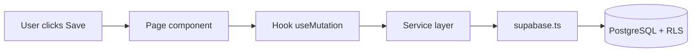
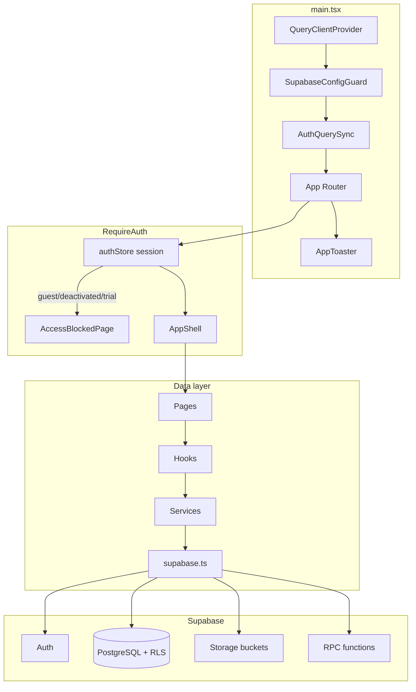
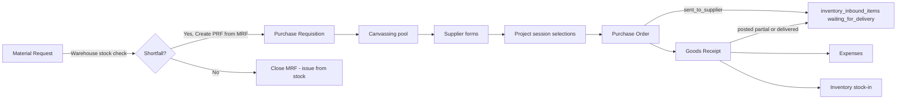
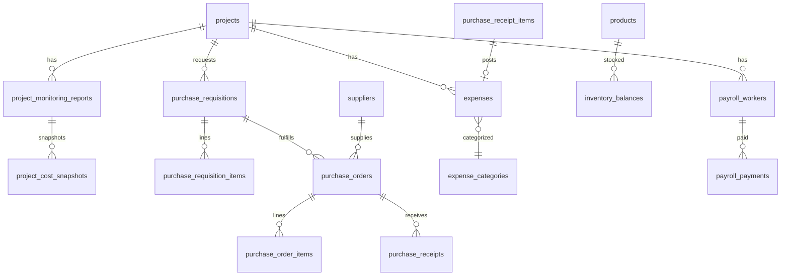

# Expensio Business — System Documentation

Technical reference and **developer takeover guide** for **Expens.io Business**, an enterprise financial operations and procurement ERP for construction companies. The system replaces four legacy Excel workbooks with a unified React SPA backed by Supabase (PostgreSQL, Auth, Row Level Security, Storage).

**How to read this document**

- **New to the project?** Start with [Quick start](#quick-start--run-the-app-locally), then [Concepts for new developers](#concepts-for-new-developers) and [Your first week](#your-first-week).
- **Making a change?** Use [Where to change what](#where-to-change-what-cookbook) and [Troubleshooting for developers](#troubleshooting-for-developers).
- **Need depth on a module?** Jump to the reference sections below (architecture, data model, features by module, etc.).

For end-user procedures, see [USER_MANUAL.md](./USER_MANUAL.md). For Excel migration steps, see [IMPORT_RUNBOOK.md](./IMPORT_RUNBOOK.md).

---

## Table of contents

### Developer onboarding

1. [Quick start — run the app locally](#quick-start--run-the-app-locally)
2. [Concepts for new developers](#concepts-for-new-developers)
3. [Your first week](#your-first-week)
4. [Where to change what (cookbook)](#where-to-change-what-cookbook)
5. [Troubleshooting for developers](#troubleshooting-for-developers)
6. [Learning resources and documentation map](#learning-resources-and-documentation-map)

### System reference

7. [Purpose and scope](#purpose-and-scope)
8. [Technology stack](#technology-stack)
9. [High-level architecture](#high-level-architecture)
10. [Design system and theme](#design-system-and-theme)
11. [Application shell and layout](#application-shell-and-layout)
12. [Front-end structure](#front-end-structure)
13. [Routing and access control](#routing-and-access-control)
14. [Features by module](#features-by-module)
15. [Business workflows](#business-workflows)
16. [Authentication and authorization](#authentication-and-authorization)
17. [Client infrastructure](#client-infrastructure)
18. [Data model](#data-model)
19. [Supabase backend](#supabase-backend)
20. [Excel import and export](#excel-import-and-export)
21. [Configuration and operations](#configuration-and-operations)
22. [Related documentation](#related-documentation)

---

## Quick start — run the app locally

Follow these steps to get a working local copy. You need access to a Supabase project (hosted or local via Supabase CLI).

### Prerequisites

| Tool | Version | Purpose |
|------|---------|---------|
| [Node.js](https://nodejs.org/) | **22+** (see [`.node-version`](../.node-version)) | Run dev server, build, tests |
| npm | Comes with Node | Install dependencies |
| Git | Any recent version | Clone the repository |
| Code editor | VS Code or Cursor recommended | Edit source files |
| [Supabase CLI](https://supabase.com/docs/guides/cli) | Optional but recommended | Apply database migrations locally |

You do **not** need Next.js, Docker, or a custom backend server for local development.

### Step-by-step setup

**1. Clone and install dependencies**

```bash
git clone <repository-url>
cd Expensio_Business
npm install
```

**2. Configure environment variables**

Copy the example env file and fill in your Supabase credentials:

```bash
cp .env.example .env.local
```

Edit `.env.local`:

```
VITE_SUPABASE_URL=https://your-project.supabase.co
VITE_SUPABASE_ANON_KEY=your-anon-or-publishable-key
```

Find these values in **Supabase Dashboard → Project Settings → API** (Project URL and anon/public key).

**3. Apply database migrations**

From the project root, with the Supabase CLI linked to your project:

```bash
supabase db push
```

This applies every migration in [supabase/migrations/](../supabase/migrations/) (currently `001` through `163`+ — check the folder for the latest number). If you use a hosted project without the CLI, apply the same files in numeric order via **Supabase Dashboard → SQL Editor**.

Do **not** apply files in `supabase/migrations/_archive/` — those are legacy.

**4. Create storage buckets**

In **Supabase Dashboard → Storage**, create these **private** buckets if they do not exist:

- `receipts`
- `procurement`
- `ocr-inbox`
- `company-assets`

**5. Bootstrap your first admin account**

Auth is **invite-only** (public signup is disabled). See [AUTH_RUNBOOK.md](./AUTH_RUNBOOK.md) for the full flow:

1. In **Supabase Dashboard → Authentication → Users**, click **Invite user** and enter your email.
2. Open the invite email, set a password, and sign in at `http://localhost:5173/login`.
3. You will see **Access pending** — your role starts as `guest`.
4. In **Supabase Dashboard → SQL Editor**, run:

```sql
UPDATE user_profiles SET role = 'president' WHERE email = 'your@email.com';
```

5. In the app, click **Check again** on the pending screen (or sign out and sign back in).

**6. Start the dev server**

```bash
npm run dev
```

Open **http://localhost:5173** in your browser.

**7. Verify the project is healthy**

```bash
npm run lint
npm run test
```

Both should complete without errors.

### You should see

| Step | Expected result |
|------|-----------------|
| Before env vars | `SupabaseConfigGuard` blocks the app with a configuration message |
| After env vars, before login | Login page at `/login` |
| After invite + owner SQL | Dashboard at `/dashboard` with sidebar navigation |
| After `npm run test` | Vitest reports passing tests |

---

## Concepts for new developers

This section explains the stack in plain language. You do not need to memorize everything — use it as a glossary while reading code.

### What this app is (and is not)

| Yes | No |
|-----|-----|
| React single-page app (SPA) | Next.js (no SSR, no `app/` or Next `pages/` router) |
| Built with **Vite 8** | Custom Node.js API server in production |
| Backend = **Supabase** (PostgreSQL + Auth + Storage) | In-app OCR engine (upload only; external processor) |
| Deployed as static files (`dist/`) | Server-rendered HTML per request |

> **This project does not use Next.js.** Routing is client-side via React Router in [`src/App.tsx`](../src/App.tsx). Node.js runs the dev server, build, and test scripts only — it is not the production API.

### Key terms

| Term | Plain explanation | Where in this repo |
|------|-------------------|-------------------|
| **SPA** | One HTML page; React swaps screens without full page reloads | [`index.html`](../index.html), [`src/main.tsx`](../src/main.tsx) |
| **Vite** | Dev server and production bundler | [`vite.config.ts`](../vite.config.ts), `npm run dev` |
| **Node.js** | Runtime for build, test, and CLI scripts — not the live backend | [`package.json`](../package.json) scripts |
| **TypeScript** | JavaScript with types; all app logic is written in `.ts` / `.tsx` | [`src/`](../src/) |
| **Supabase** | Hosted PostgreSQL database, user auth, and file storage | [`src/lib/supabase.ts`](../src/lib/supabase.ts) |
| **Hook** | React function that loads or updates data (wraps TanStack Query) | [`src/hooks/`](../src/hooks/) — e.g. `usePayroll.ts` |
| **Service** | Functions that call Supabase (tables, RPC, storage) | [`src/services/`](../src/services/) — e.g. `payroll.ts` |
| **Page** | Full-screen route component the user navigates to | [`src/pages/`](../src/pages/) — e.g. `PayrollPage.tsx` |
| **RLS** | Row Level Security — PostgreSQL rules that enforce who can read/write; **real security** | [`supabase/migrations/016_rls.sql`](../supabase/migrations/016_rls.sql) |
| **Migration** | SQL file that creates or changes database schema | [`supabase/migrations/`](../supabase/migrations/) |
| **RPC** | Named SQL function called from TypeScript via `supabase.rpc(...)` | e.g. `get_dashboard_summary` in [`014_functions.sql`](../supabase/migrations/014_functions.sql) |
| **TanStack Query** | Caches server data, handles loading/error states | [`src/lib/queryClient.ts`](../src/lib/queryClient.ts) |
| **Zustand** | Small in-memory stores (auth session, UI theme) | [`src/store/`](../src/store/) |

### How data flows (the pattern to learn first)

Almost every feature follows the same path:

**Page → Hook → Service → Supabase**

Example — Payroll:

1. [`PayrollPage.tsx`](../src/pages/payroll/PayrollPage.tsx) renders the grid and buttons.
2. [`usePayroll.ts`](../src/hooks/usePayroll.ts) loads data with TanStack Query and exposes create/update mutations.
3. [`payroll.ts`](../src/services/payroll.ts) calls `supabase.from('payroll_workers')` and `supabase.rpc(...)`.
4. PostgreSQL applies **RLS** before returning or saving rows.

UI permission checks ([`permissions.ts`](../src/lib/permissions.ts), `PermissionGuard`) improve user experience but **do not replace RLS**. Never rely on hiding a button as security.



### Frontend vs backend boundary

| Layer | Language | Runs where |
|-------|----------|------------|
| UI (pages, components) | TypeScript / TSX | User's browser |
| Services + hooks | TypeScript | User's browser |
| Schema, RLS, triggers, RPC | SQL / PL/pgSQL | Supabase (PostgreSQL) |
| Auth sessions | Supabase Auth | Supabase |
| File attachments | Supabase Storage | Supabase |

There are **no Supabase Edge Functions** in this repository. Business rules that must be trusted live in SQL (RLS, triggers, RPC), not only in TypeScript.

---

## Your first week

Suggested path for taking over the codebase. Adjust pace as needed.

| Day | Task | Where to look |
|-----|------|---------------|
| **1** | Complete [Quick start](#quick-start--run-the-app-locally); log in as `president` | This doc, [AUTH_RUNBOOK.md](./AUTH_RUNBOOK.md) |
| **1** | Click through every sidebar group (Dashboard, Projects, Finance, Procurement, etc.) | [`Sidebar.tsx`](../src/components/shell/Sidebar.tsx) |
| **2** | Trace one screen end-to-end — e.g. Payroll | `PayrollPage` → `usePayroll` → `payroll.ts` |
| **2** | Read how routes and login gating work | [`App.tsx`](../src/App.tsx), [`authStore.ts`](../src/store/authStore.ts) |
| **3** | Open one table migration (e.g. `004_expenses_payroll.sql`) and one RPC file (`014_functions.sql`) | [`supabase/migrations/`](../supabase/migrations/) |
| **3** | In Supabase Dashboard, browse **Table Editor** for `projects`, `expenses`, `user_profiles` | Supabase Dashboard |
| **4** | Run `npm run test` and read one test file | e.g. [`src/services/__tests__/`](../src/services/__tests__/) |
| **5** | Make a safe UI-only change (page title or button label) and confirm it in the browser | Any file under [`src/pages/`](../src/pages/) |

### Change boundaries

| Risk | Examples | Guidance |
|------|----------|----------|
| **Safe** | Label text, styling, chart titles, empty-state copy | Edit pages/components; run `npm run dev` and visually check |
| **Careful** | Services, hooks, Zod schemas, types | Affects data flow; run `npm run test` and test the feature manually |
| **Ask first / pair** | SQL migrations, RLS policies, auth roles, `SUPABASE_SERVICE_ROLE_KEY` | Can break production data or security; review with someone experienced |

---

## Where to change what (cookbook)

Use this table to find the right files before editing.

| I want to… | Start here | May also need |
|------------|-----------|---------------|
| Change page layout, button, or copy | `src/pages/…`, `src/components/…` | — |
| Change table columns or sorting | Page file + `DataTable` column definitions | `src/types/` |
| Add or edit a form field | Page dialog + `src/lib/schemas/` | Service, types, possibly a SQL migration |
| Change who sees a sidebar item | [`permissions.ts`](../src/lib/permissions.ts), [`Sidebar.tsx`](../src/components/shell/Sidebar.tsx) | RLS in SQL if data access changes |
| Add a database column | New numbered file in `supabase/migrations/` | Types, service, form, RLS policy |
| Fix Excel import layout | [`excelLayouts.ts`](../src/lib/excelLayouts.ts), [`importOrchestrator.ts`](../src/services/excel/importOrchestrator.ts) | [IMPORT_RUNBOOK.md](./IMPORT_RUNBOOK.md) |
| Add a user or change a role | [AUTH_RUNBOOK.md](./AUTH_RUNBOOK.md), Admin → Users in app | — |
| Deploy to production | [DEPLOYMENT.md](./DEPLOYMENT.md) | — |
| Fix a chart or KPI | Page + `useDashboard` / module hook | [`dashboard.ts`](../src/services/dashboard.ts), RPC in SQL |

### Worked example: trace Daily Expenses save

When a user saves a daily expense row:

1. **UI** — [`DailyExpensesPage.tsx`](../src/pages/daily-expenses/DailyExpensesPage.tsx) opens a form dialog and calls the hook mutation on submit.
2. **Hook** — [`useDailyExpenses.ts`](../src/hooks/useDailyExpenses.ts) → `useDailyExpenseMutations().create` wraps TanStack Query `useMutation`.
3. **Service** — [`dailyExpenses.ts`](../src/services/dailyExpenses.ts) delegates to [`expenses.ts`](../src/services/expenses.ts) with `scope: 'daily'`.
4. **Database** — Row inserted into `expenses` with `expense_scope = 'daily'`; RLS checks `is_write_role()`; trigger `calc_expense_vat` computes VAT.
5. **Cache refresh** — Hook invalidates `['daily-expenses']` queries so the table reloads.

To debug a save failure, check the browser **Network** tab for the Supabase request, then verify your role in `user_profiles` and the RLS policies on `expenses`.

---

## Troubleshooting for developers

### Common problems

| Symptom | Likely cause | Fix |
|---------|--------------|-----|
| Blank app or "Supabase is not configured" | Missing or wrong `.env.local` | Set `VITE_SUPABASE_URL` and `VITE_SUPABASE_ANON_KEY`; **restart** `npm run dev` |
| Login works but **Access pending** | Role is still `guest` | Run owner SQL from [Quick start](#quick-start--run-the-app-locally) or use Admin → Users |
| **Access denied** on a page | Role lacks UI permission | Check [`permissions.ts`](../src/lib/permissions.ts); may be expected for your role |
| Save fails / empty error / 403 in Network tab | RLS blocking the operation | Check `user_profiles.role` and `is_active` in Supabase; compare with RLS in `016_rls.sql` |
| Production build fails | Env vars missing at build time | Set `VITE_*` in host dashboard **before** `npm run build` — see [DEPLOYMENT.md](./DEPLOYMENT.md) |
| Migration error / duplicate object | Wrong order or re-applying old SQL | Use `supabase db push`; never mix `_archive/` with current chain |
| Stuck loading spinner after navigation | Query hung | Browser **Network** tab; see [`resumeStuckQueries.ts`](../src/lib/resumeStuckQueries.ts) |
| `npm install` or build fails on Node version | Node too old | Install Node **22+** (`node -v` should show v22.x) |

### Where to look when debugging

| Tool | Use for |
|------|---------|
| Browser **Console** (F12) | JavaScript errors, React warnings |
| Browser **Network** tab | Failed Supabase API calls (status 401, 403, 500) |
| **Supabase → Logs → Postgres** | SQL errors from RPC or RLS |
| **Supabase → Table Editor** | Verify data was saved; inspect `user_profiles` |
| **Supabase → SQL Editor** | Run test queries; promote users; inspect roles |
| Terminal `npm run test` | Regressions in services and utilities |
| Terminal `npm run lint` | TypeScript / ESLint issues |

---

## Learning resources and documentation map

### External resources (learn the stack)

| Topic | Resource |
|-------|----------|
| React | [react.dev](https://react.dev) — components, hooks, state |
| TypeScript | [typescriptlang.org/docs](https://www.typescriptlang.org/docs/) — handbook basics |
| Supabase | [supabase.com/docs](https://supabase.com/docs) — JS client, Auth, RLS, Storage |
| TanStack Query | [tanstack.com/query](https://tanstack.com/query/latest) — queries, mutations, cache |
| Tailwind CSS | [tailwindcss.com/docs](https://tailwindcss.com/docs) — utility classes |
| Vite | [vite.dev/guide](https://vite.dev/guide/) — dev server and build |
| React Router | [reactrouter.com](https://reactrouter.com) — client-side routing |

### Internal documentation (read when)

| Document | Read when you need to… |
|----------|------------------------|
| [USER_MANUAL.md](./USER_MANUAL.md) | Understand what end users do in each module |
| [AUTH_RUNBOOK.md](./AUTH_RUNBOOK.md) | Invite users, assign roles, configure invite-only auth |
| [IMPORT_RUNBOOK.md](./IMPORT_RUNBOOK.md) | Import legacy Excel workbooks (UI wizard or CLI) |
| [DEPLOYMENT.md](./DEPLOYMENT.md) | Deploy to Vercel, Cloudflare Pages, or GitHub Pages |
| [OCR_INTEGRATION.md](./OCR_INTEGRATION.md) | Integrate or debug the external OCR processor |
| [expensio_business_blueprint.md](./expensio_business_blueprint.md) | UI design specification and visual direction |
| [README.md](../README.md) | Short project overview (this doc is the canonical developer reference) |

---

## Purpose and scope

Expensio Business centralizes operational finance data previously maintained in separate spreadsheets:

| Legacy workbook | Application module |
|-----------------|-------------------|
| Daily Expenses Report.xlsx | Daily Expenses (`expenses` where `expense_scope = 'daily'`) |
| Project Expenses Report.xlsx | Project Expenses (`expenses` where `expense_scope = 'project'`) |
| Payroll Summary.xlsx | Payroll (`payroll_workers` + `payroll_payments`) |
| Project Monitoring Report.xlsx | Monitoring (`project_monitoring_reports` + `project_cost_snapshots`) |

Beyond Excel parity, the greenfield schema (`001`–`061`) adds full **procure-to-pay**, **inventory**, **supplier management**, and **asset tracking**:

| Domain | Capabilities |
|--------|--------------|
| **Procurement** | MRF (warehouse stock check) → PRF → canvassing → PO → goods receipt; multi-step approvals |
| **Suppliers** | Contacts, catalog, price history, SPI, tokenized public accreditation |
| **Products & inventory** | SKU catalog, warehouses, balances, movements, reservations |
| **Assets** | Fixed-asset registry linked to receipt lines |
| **Documents / OCR** | File storage with external OCR extraction pipeline |
| **Finance** | Unified expenses, normalized payroll, slim PMR with live cost breakdown |
| **Governance** | Approval queue with steps, audit logs, role-based RLS |
| **Admin** | Users, feature flags, company profile for PDF forms |

Sample workbooks live in `src/assets/sample/` and drive layout detection for import/export.

---

## Technology stack

| Layer | Technology |
|-------|------------|
| Runtime | Node.js `>=22` (dev/build/test only — not a production API server) |
| Build | Vite 8 (not Next.js) |
| UI | React 19, TypeScript |
| Styling | Tailwind CSS 3, design tokens (`src/lib/designTokens.ts`), shadcn-style primitives (`src/components/ui`) |
| Routing | React Router 7 (lazy-loaded route modules) |
| Server state | TanStack Query 5 (`staleTime: 30s`, route-change invalidation in `AppShell`) |
| Client state | Zustand 5 (`authStore`, `uiStore`) |
| Forms / validation | React Hook Form, Zod 4, `@hookform/resolvers` |
| Tables | TanStack Table via `DataTable` wrapper |
| Charts | Recharts 3, Reaviz (select charts) inside `ChartWrapper` |
| Spreadsheets | **xlsx** (SheetJS) for import; **ExcelJS** + **xlsx** for export |
| PDF | `@react-pdf/renderer` (intended PDF generators; see [Client infrastructure](#client-infrastructure)) |
| Fuzzy matching | Fuse.js (migration project matching) |
| Motion | Framer Motion (select UI transitions) |
| Backend | Supabase JS client — PostgreSQL, Auth, RLS, Storage, RPC |
| Notifications | Sonner base + custom `AiToast` wrapper (`src/components/feedback/toast/`, `src/lib/toast.tsx`) |
| Dialogs | Radix UI (`@radix-ui/react-dialog`, `@radix-ui/react-switch`) |
| Testing | Vitest (`npm run test`) |

Environment variables (see `.env.example`):

| Variable | Purpose |
|----------|---------|
| `VITE_SUPABASE_URL` | Supabase project URL |
| `VITE_SUPABASE_ANON_KEY` | Anon or publishable key for browser client |
| `VITE_SUPABASE_PUBLISHABLE_KEY` | Optional alias when anon key not set |
| `VITE_SKIP_ENV_CHECK` | Skip Vite production build env guard (CI only) |
| `SUPABASE_URL` | CLI migration (`scripts/migrate-from-excel-cli.ts`) |
| `SUPABASE_SERVICE_ROLE_KEY` | CLI migration (recommended over anon key) |

---

## High-level architecture



**Request flow:** **Pages → Hooks → Services → Supabase** (`src/lib/supabase.ts`). Hooks wrap TanStack Query; services own CRUD, RPC, and Excel logic. Client-side guards (`PermissionGuard`, `RequireAuth`, `useRole`) improve UX only; **PostgreSQL RLS, storage policies, and RPC auth checks are the enforcement boundary.**

**Path alias:** `@/` resolves to `src/` (`vite.config.ts`).

### Application bootstrap (`src/main.tsx`)

| Provider / side effect | Role |
|------------------------|------|
| `QueryClientProvider` | TanStack Query client from `src/lib/queryClient.ts` |
| `SupabaseConfigGuard` | Blocks app when `VITE_SUPABASE_*` env vars missing |
| `AuthQuerySync` | Invalidates queries on auth state change |
| `App` | React Router tree |
| `AppToaster` | Global Sonner + custom toast styling |
| `subscribeStuckQueryRecovery` | Recovers queries stuck after fast navigation |

### State management

| Concern | Implementation |
|---------|----------------|
| Auth session + profile | `authStore` — `initialize()`, `onAuthStateChange`, calls `expire_trial_users` RPC on init |
| Sidebar / mobile drawer / theme | `uiStore` |
| Remote data | TanStack Query — keys per entity and filter |
| Mutations | `useMutation` in domain hooks; targeted `invalidateQueries` |
| Query recovery | `resumeStuckQueries.ts`, `queryRecovery.ts`, `supabaseAbort.ts`, `supabaseFetch.ts` |

**Resilience:** Authenticated routes use `ErrorBoundary` + `Suspense` (`PageFallback`). `AppShell` cancels orphaned queries and resumes stuck fetches on navigation.

### Client access gate (`RequireAuth` in `src/App.tsx`)

Before rendering `AppShell`, `RequireAuth` checks (in order):

1. Session exists → else redirect `/login`
2. `temp_finance` trial not expired → else `AccessBlockedPage` (`trial_expired`)
3. `profile.is_active` → else `AccessBlockedPage` (`deactivated`)
4. Role not `guest` → else `AccessBlockedPage` (`pending`)

RLS `has_app_access()` mirrors these rules server-side.

---

## Design system and theme

Expens.io Business uses a **dark enterprise fintech** visual language aligned with the consumer Expens.io product family (see `docs/expensio_business_blueprint.md`).

### Brand

- Product name: **Expens.io Business**
- Tagline on login: *Enterprise Financial Operations*
- Logo: `src/assets/images/logo.png` via `Logo` component (`src/components/brand/Logo.tsx`)

### Color palette

Canonical tokens in `src/lib/designTokens.ts` and mirrored in `tailwind.config.ts` / `src/index.css`:

| Token | Hex | Usage |
|-------|-----|--------|
| `bgBase` | `#0B0C10` | Page background |
| `bgSurface` | `#12151C` | Sidebar, top bar |
| `bgElevated` | `#1A1E2A` | Inputs, elevated panels |
| `bgCard` | `#181C27` | KPI cards, content cards |
| `border` / `borderSubtle` | `#1F2535` / `#252B3B` | Dividers, inputs |
| `accentPrimary` | `#0099FF` | Primary actions, active nav, links |
| `accentSecondary` (teal) | `#00E0D3` | Secondary accents, info KPI variant |
| `success` | `#22C55E` | Positive profit, success states |
| `warning` | `#F59E0B` | Outstanding balance, invoice alerts |
| `danger` | `#EF4444` | Errors, negative profit, audit "before" |
| `textPrimary` | `#F0F4FF` | Headings, body |
| `textSecondary` | `#8892A4` | Subtitles, table secondary text |
| `textTertiary` | `#4B5563` | Nav group labels, muted meta |

Charts use `chartPalette` from `designTokens.ts`. Sidebar nav groups use module color stripes (`module-procurement`, `module-finance`, etc.). Dashboard KPI cards may use `BorderGlow` (`src/components/ui/BorderGlow.tsx`).

### Typography

| Role | Font | Tailwind class |
|------|------|----------------|
| Display / page titles | Syne 600–800 | `font-display` |
| Body | Manrope 400–700 | `font-body` (default on `body`) |
| Labels, IDs, timestamps | JetBrains Mono | `font-mono` |

### Component patterns

| Pattern | Component | Notes |
|---------|-----------|-------|
| KPI metrics | `KPICard`, `DashboardGroupCard` | Variants: `default`, `success`, `warning`, `danger`, `info` |
| Status | `StatusBadge`, `ApprovalBadge`, `RoleBadge` | Approval/invoice/role states |
| Data lists | `DataTable` | Sortable columns, row click, loading skeleton |
| Page chrome | `PageHeader`, `PageContainer` | Title, subtitle, actions, tab bar |
| Charts | `ChartWrapper`, `BudgetBurnBar`, `ProcurementPipelineChart` | Recharts + themed wrappers |
| Feedback | `ErrorBoundary`, `QueryState`, `EmptyState`, `AppToaster` | Route errors, query UX, toasts |
| Procurement forms | `PRFFormLayout`, `POFormLayout`, `ReceiptPostCategoryDialog` | On-screen printable layouts |

Form controls share `selectClass` and `filterChipClass` from `src/lib/uiClasses.ts`.

---

## Application shell and layout

Authenticated pages render inside **`AppShell`** (`src/components/shell/AppShell.tsx`).

```
┌─────────────────────────────────────────────────────────────┐
│ Sidebar (fixed)  │ TopBar (fixed, offset by sidebar width) │
│ 220px / 64px     ├──────────────────────────────────────────┤
│ collapsed        │ Main content (Outlet)                    │
│                  │ px-4 md:px-8, pt-14                      │
└──────────────────┴──────────────────────────────────────────┘
```

- **Sidebar:** collapsible (220px / 64px icon-only); mobile off-canvas drawer
- **TopBar:** user avatar, name, role badge, sign out
- **Outlet:** `<Outlet key={location.pathname} />` remounts on navigation

### Sidebar groups

| Group | Items | Permission gate |
|-------|-------|-----------------|
| Overview | Dashboard, Projects | — |
| Procurement | Suppliers, Material Requests, Requisitions, Canvassing, Purchase Orders, Receipts | `canManageSuppliers` / `canManageProcurement` |
| Inventory | Inventory, Products, Warehouses, Movements | `canManageInventory` / `canViewProducts` |
| Finance | Daily Expenses, Project Expenses, Payroll, Monitoring, Data Migration | Migration: `canCreate` |
| Documents | OCR Documents | `canViewDocuments` |
| Reports | Inventory Logs, Supplier Performance | `canViewReports` |
| Operations | Approvals, Assets | Approvals: `canApprove` |
| System | Audit Logs, Settings (`/admin/settings`), Admin (`/admin`) | Audit: `canViewAudit`; Admin: `canConfigureSettings` |

---

## Front-end structure

```
src/
├── components/
│   ├── shell/          AppShell, Sidebar, TopBar, PageHeader, PageContainer
│   ├── brand/          Logo
│   ├── cards/          KPICard, ProjectCard, ApprovalCard, DashboardGroupCard
│   ├── charts/         ChartWrapper, BudgetBurnBar, ProcurementPipelineChart, …
│   ├── tables/         DataTable
│   ├── forms/          ProjectSelect, CurrencyInput, FormSection
│   ├── procurement/    PRFFormLayout, POFormLayout, ReceiptPostCategoryDialog, …
│   ├── badges/         StatusBadge, ApprovalBadge, RoleBadge
│   ├── feedback/       ErrorBoundary, AppToaster, toast/, QueryState, EmptyState
│   ├── auth/           SupabaseConfigGuard, AuthQuerySync
│   ├── shared/         PermissionGuard, LoadingSpinner
│   └── ui/             Button, Input, Card, BorderGlow, …
├── hooks/              Domain hooks (see table below)
├── pages/              37 route screens by feature folder
├── services/           Supabase CRUD, RPC, excel/, procurement/, suppliers/
├── store/              authStore, uiStore
├── lib/                supabase, permissions, designTokens, excelLayouts, pdfFormActions, …
└── types/              Split TypeScript models (expenses, procurement, suppliers, …)
```

### Pages (37 screens)

| Folder | Pages |
|--------|-------|
| `auth/` | `LoginPage`, `AccessBlockedPage` |
| `dashboard/` | `DashboardPage` |
| `projects/` | `ProjectsPage`, `ProjectDetailPage` |
| `project-monitoring/` | `ProjectMonitoringPage` |
| `daily-expenses/`, `project-expenses/`, `payroll/` | Finance registers |
| `migration/` | `MigrationPage` (multi-step Excel wizard) |
| `procurement/` | MRF, PRF, PO, receipts, canvassing (10 pages) |
| `suppliers/` | `SuppliersPage`, `SupplierDetailPage`, `SupplierAccreditationPublicPage` |
| `products/` | `ProductsPage`, `ProductDetailPage` |
| `inventory/` | `InventoryPage`, `WarehousesPage`, `InventoryMovementsPage` |
| `assets/` | `AssetsPage`, `AssetDetailPage` |
| `reports/` | `InventoryLogsPage`, `SupplierPerformancePage` |
| `ocr/` | `OCRPage` |
| `approvals/`, `audit/` | `ApprovalQueuePage`, `AuditLogsPage` |
| `admin/` | `AdminPage`, `UsersPage`, `SettingsPage` |

### Hooks

| Hook | Domain |
|------|--------|
| `useAuth`, `useRole` | Session and `RolePermissions` |
| `useDashboard` | Dashboard KPIs and charts |
| `useProjects` | Project CRUD and detail |
| `useDailyExpenses`, `useProjectExpenses` | Expense registers by scope |
| `usePayroll` | Payroll workers and payments |
| `useProjectMonitoring` | PMR reports and cost breakdown |
| `useMaterialRequests` | MRF header/items, approval workflow, availability/reservations |
| `useProcurement` | PRF, PO, receipts, canvassing (large composite hook) |
| `useSuppliers` | Supplier directory, SPI, accreditations |
| `useProducts` | Products, categories, UOM |
| `useInventory` | Balances, warehouses, movements |
| `useAssets` | Fixed assets |
| `useApprovals` | Approval queue, PRF multi-step logic |
| `useAuditLogs` | Audit trail |
| `useDocuments` | OCR document upload/list |
| `useAppSettings`, `useUserProfiles` | Settings and admin users |
| `useExpenseCategories`, `useCostCenters` | Reference data |
| `useMigrationProgress`, `useExcel` | Migration wizard and Excel I/O |
| `useQueryLoading`, `useLayoutMode`, `useChartTheme` | UI utilities |

### Services

| Service | Tables / RPCs |
|---------|---------------|
| `projects.ts` | `projects` |
| `dailyExpenses.ts`, `projectExpenses.ts`, `expenses.ts` | `expenses` |
| `payroll.ts` | `payroll_workers`, `payroll_payments` |
| `projectMonitoring.ts`, `expenseMonitoringSync.ts` | PMR, `get_project_cost_breakdown`, `recalculate_pmr_totals` |
| `dashboard.ts` | Dashboard RPCs |
| `approvals.ts`, `approvalsEnrichment.ts` | `approval_queue`, `approval_steps` |
| `auditLogs.ts` | `audit_logs` |
| `appSettings.ts` | `app_settings`, `update_company_profile` |
| `products.ts`, `costCenters.ts`, `expenseCategories.ts` | Catalog reference data |
| `assets.ts`, `documents.ts` | `assets`, `documents`, `ocr_extractions` |
| `suppliers.ts`, `suppliers/accreditations.ts`, `suppliers/accreditationRequests.ts` | Supplier domain + public RPCs |
| `procurement/materialRequests.ts` | `material_requests`, `material_request_items`, `mark_mrf_item_availability`, `fulfill_mrf_reservation`, `release_mrf_reservation` |
| `procurement/requisitions.ts`, `canvassing.ts`, `purchaseOrders.ts`, `receipts.ts` | Procure-to-pay |
| `inventory/index.ts` | Warehouses, balances, movements |
| `excel/importer.ts`, `exporter.ts`, `importOrchestrator.ts`, `supplierImport.ts` | Excel I/O |
| `projectMatchingService.ts`, `projectAutoCreateService.ts` | Migration fuzzy matching |

Vitest coverage lives under `src/services/__tests__/`, `src/hooks/__tests__/`, and `src/lib/__tests__/`.

### Types (`src/types/`)

| File | Contents |
|------|----------|
| `index.ts` | Core types, `RolePermissions`, re-exports |
| `expenses.ts` | `Expense`, `ExpenseScope`, `PurchaseOrigin` |
| `payroll.ts` | Payroll worker/payment models |
| `projectCosting.ts` | PMR types |
| `materialRequests.ts` | `MaterialRequest`, `MaterialRequestItem`, `MRFLineItemDraft`, `MRFAvailabilityDraft` |
| `procurement.ts` | PRF, PO, receipt, canvassing hierarchy |
| `suppliers.ts` | Supplier, SPI, accreditation types |
| `products.ts`, `inventory.ts`, `assets.ts` | Catalog and operations |
| `ocr.ts` | Document and OCR extraction |
| `excel.ts`, `migration.ts` | Import/export and matching tiers |

---

## Routing and access control

Defined in `src/App.tsx`. Public routes: `/login`, `/supplier-accreditation/:token`. All other app routes use `RequireAuth` → `AppShell`.

| Path | Page | Access |
|------|------|--------|
| `/dashboard` | Dashboard | Authenticated (non-guest, active) |
| `/projects`, `/projects/:id` | Projects | Authenticated |
| `/project-monitoring` | Monitoring | Authenticated |
| `/daily-expenses`, `/project-expenses` | Expenses (by scope) | Authenticated |
| `/payroll` | Payroll | Authenticated |
| `/products`, `/products/:id` | Products | `canViewProducts` |
| `/suppliers`, `/suppliers/:id` | Suppliers | `canManageSuppliers` |
| `/material-requests`, `/material-requests/:id` | MRF | `canManageMaterialRequests` |
| `/purchase-requisitions`, `/purchase-requisitions/:id` | PRF | `canManageProcurement` |
| `/canvassing`, `/canvassing/:id`, `/canvassing/:sessionId/forms/:formId` | Canvassing | `canManageProcurement` |
| `/purchase-orders`, `/purchase-orders/:id` | PO | `canManageProcurement` |
| `/purchase-receipts`, `/purchase-receipts/:id` | Receipts | `canManageProcurement` |
| `/inventory`, `/warehouses`, `/inventory-movements` | Inventory | `canManageInventory` |
| `/assets`, `/assets/:id` | Assets | Authenticated |
| `/reports/inventory-logs` | Inventory logs | `canViewReports` |
| `/reports/supplier-performance` | Supplier SPI | `canViewReports` |
| `/ocr` | OCR documents | `canViewDocuments` |
| `/migration` | Data Migration | `canCreate` |
| `/approvals` | Approval Queue | `canApprove` |
| `/audit` | Audit Logs | `canViewAudit` |
| `/admin/*` | Admin shell | `canView` (any authenticated user with access) |
| `/admin/users` | User management | `canConfigureSettings` (president/developer) |
| `/admin/settings` | Company profile + toggles | Authenticated; company profile and workflow toggles admin-only |

**Redirect patterns:** list pages use query params for create/edit (`?create=1`, `?edit=:id`); `/purchase-receipts/new` may pass `poId`; legacy `/projects/new` redirects to `/projects`.

`PermissionGuard` redirects to `/access-denied` when the required permission is false. This is not a security control — direct Supabase API calls bypass UI guards.

### Permission flags (`RolePermissions`)

| Flag | Typical use |
|------|-------------|
| `canView` | Base authenticated access |
| `canCreate`, `canEdit`, `canDelete`, `canExport` | Finance write operations |
| `canApprove` | Approval queue |
| `canViewAudit` | Audit logs |
| `canConfigureSettings` | Admin users + workflow toggles |
| `canManageMaterialRequests` | Material Requests (MRF) |
| `canManageProcurement` | PRF, PO, receipts, canvassing |
| `canManageInventory` | Inventory, warehouses, movements |
| `canManageSuppliers` | Supplier directory |
| `canViewProducts` | Product catalog |
| `canViewDocuments` | OCR inbox |
| `canViewReports` | Inventory logs, supplier performance |

---

## Features by module

### Dashboard

- Year selector drives KPIs and charts
- **Extended KPIs** via `get_dashboard_summary` RPC: finance YTD, procurement pipeline, inventory, governance
- **Charts:** monthly expenses, category breakdown, payroll trend, profitability, AR aging, procurement pipeline
- **Governance widget:** `get_pending_approvals_summary` by `entity_type`
- **Implementation:** `DashboardPage` → `useDashboard` → `dashboard.ts`; chart data helpers in `dashboardChartData.ts`; `BorderGlow` on KPI groups

### Projects

- Master registry; detail tabs: Overview, Daily Expenses, Project Expenses, Payroll, Monitoring
- PMR auto-provision per year via `ensure_pmrs_for_year` trigger
- **Implementation:** `ProjectsPage`, `ProjectDetailPage` → `useProjects` → `projects.ts`

### Monitoring (PMR)

- Slim financial columns; live breakdown via `get_project_cost_breakdown`; snapshots on approval
- Excel import/export (`CONTRACTED REPORT {year}`)
- **Implementation:** `ProjectMonitoringPage` → `useProjectMonitoring` → `projectMonitoring.ts`

### Expenses (daily and project)

- Unified `expenses` table filtered by `expense_scope`; VAT trigger; receipt-linked `po_receipt` lines
- **Implementation:** `DailyExpensesPage` / `ProjectExpensesPage` → `useDailyExpenses` / `useProjectExpenses` → `dailyExpenses.ts` / `projectExpenses.ts`

### Payroll

- `payroll_workers` + `payroll_payments`; semi-monthly grid; optional row lock
- **Implementation:** `PayrollPage` → `usePayroll` → `payroll.ts`

### Material Requests (MRF)

- Pre-purchase stock check: a `civil_engineer` requests items for a project; line items are typed into a single Description field that live-searches `products` (`ProductTypeahead`) and links `product_id` when a match is picked, or stays a free-text/new item when not
- Submitting for approval routes through `approval_queue`/`approval_steps` — `operations_manager`, then `warehouse_officer` must approve (`approval_status`) before the warehouse can record availability
- Warehouse officer marks quantity available per line via `mark_mrf_item_availability` RPC, which reserves stock in `inventory_reservations` (`material_request_item_id`) against `inventory_balances`, warning on over-commitment; shortfall lines can convert to a PRF (**Create PRF from MRF**), linked back via `material_requests.linked_prf_id`
- PDF export (`generateMRFPDF`, `@react-pdf/renderer`) is gated on `approval_status = 'approved'`
- **Implementation:** `MRFDetailPage`, `MRFFormDialog`, `MRFLineItemsEditor` → `useMaterialRequests` → `procurement/materialRequests.ts`

### Procurement (MRF → PRF → Canvassing → PO → Receipt)

| Stage | Table(s) | UI notes |
|-------|----------|----------|
| Material Request | `material_requests`, `material_request_items` | `MRFFormDialog`, `MRFLineItemsEditor`, `operations_manager` → `warehouse_officer` approval chain |
| Requisition | `purchase_requisitions`, items | `PRFFormLayout`, multi-step `approval_steps` |
| Canvassing | Period pool, forms, session selections | `CanvassingPage`, `POGenerationWizard` |
| PO | `purchase_orders`, items | `POFormLayout`, version history, PDF/Excel export |
| Receipt | `purchase_receipts`, items | `ReceiptPostCategoryDialog` before post; creates expenses + inventory |

**Implementation:** procurement pages → `useProcurement` → `src/services/procurement/*`

### Suppliers

- Directory, contacts, catalog, SPI charts, evaluations, tokenized accreditation
- Separate supplier Excel import (`supplierImport.ts`)
- **Implementation:** `SuppliersPage`, `SupplierDetailPage` → `useSuppliers` → `suppliers.ts`; public form at `SupplierAccreditationPublicPage` → `sa_get_by_token` / `sa_submit_section_a`

### Products & inventory

- SKU catalog; warehouse balances; append-only movements; reservations
- **Implementation:** `useProducts`, `useInventory` → `products.ts`, `inventory/index.ts`

### Assets

- Fixed-asset register linked to receipt lines
- **Implementation:** `AssetsPage`, `AssetDetailPage` → `useAssets` → `assets.ts`

### Documents / OCR

- Upload to `ocr-inbox` bucket; external processor writes `ocr_extractions` (see [OCR_INTEGRATION.md](./OCR_INTEGRATION.md))
- **Implementation:** `OCRPage` → `useDocuments` → `documents.ts` — upload and status list only; no in-app OCR engine

### Approvals

- Unified queue for all `approval_entity` types; bulk approve; PRF step routing via `canUserApprovePRFStep`
- **Implementation:** `ApprovalQueuePage` → `useApprovals` → `approvals.ts`, `approvalsEnrichment.ts`; cache coordination via `approvalSyncCoordinator.ts`

### Data Migration

- Multi-file wizard with preview, Fuse.js project matching, manual resolution, chunked commit
- **Implementation:** `MigrationPage` → `useMigrationProgress`, `useExcel` → `importOrchestrator.ts`, `projectMatchingService.ts`

### Audit & Admin

- **Audit:** `AuditLogsPage` → `useAuditLogs` → `auditLogs.ts` (append-only)
- **Admin users:** `UsersPage` — roles, trial expiry (president/developer only)
- **Settings:** `SettingsPage` — company profile (all users with access); workflow toggles + VAT (admin only)

---

## Business workflows

### Monthly finance rhythm


PMR `total_expenses` is derived from live `expenses` + `payroll_payments` via `get_project_cost_breakdown`. Receipt posting auto-creates `po_receipt` expenses and calls `sync_pmr_for_project_year`.

### Procure-to-pay



When a PO is marked **sent to supplier**, inventory-tracked lines are posted to `inventory_inbound_items` with status `waiting_for_delivery` (expected stock — not on-hand until receipt). The send flow maps each PO line to an existing or newly created product via `POSendToSupplierDialog`.

Posting a receipt (`status → posted`) triggers: delivery confirmation in the UI, `create_expenses_for_receipt`, `update_inventory_on_receipt`, `sync_po_item_received`, `sync_inbound_on_receipt_post` (updates inbound to `partial` or `delivered`), PO header sync to `partially_received` / `fully_received`, and PMR recalculation.

Each project gets an auto-provisioned site warehouse (`warehouse_type = site`) for transfers between main warehouse and job site.

### Approval workflow

When enabled in `app_settings`, writers submit records; items land in `approval_queue` with optional `approval_steps`. Approvers update queue and entity `approval_status`. PMR approval triggers `snapshot_pmr_costs`.

### Supplier accreditation

1. Internal user creates `supplier_accreditation_requests` and calls `create_supplier_accreditation_link`
2. Supplier opens `/supplier-accreditation/:token`, submits Section A via RPC
3. Token consumed; internal team completes Section B evaluation

---

## Authentication and authorization

### Authentication

- Email/password via Supabase Auth (invite-only; signup disabled in `supabase/config.toml`)
- `handle_new_user` trigger creates `user_profiles` with role `guest`
- Provisioning: see [AUTH_RUNBOOK.md](./AUTH_RUNBOOK.md)
- First admin: `UPDATE user_profiles SET role = 'president' WHERE email = '…'`

### Client roles (`src/lib/permissions.ts`)

`ROLE_PERMISSIONS` maps each `UserRole` to a `RolePermissions` object of granular flags (`canCreate`, `canManageProcurement`, `canManageMaterialRequests`, `canManageInventory`, `canViewInventory`, `canApprove`, etc.) — see the source for the full flag list. Raw DB role names are normalized to their current display name via `normalizeUserRole()` (`src/lib/roleNormalize.ts`) before this lookup: `owner`→`president`, `accountant`→`accounting_officer`, `department_engineer`→`civil_engineer`, `hr_manager`→`human_resource_officer`, `procurement_approver`→`operations_manager`, `temp_finance`→`accounting_officer` (renamed in migrations `066`/`074`/`088`; legacy values still exist in the `user_role` enum).

| Role | Finance write | Approve | Procurement | Material Requests | Inventory | Suppliers | Audit | Admin |
|------|--------------|---------|-------------|--------------------|-----------|-----------|-------|-------|
| president | Yes | Yes | Yes | Yes | Manage | Yes | Yes | Yes |
| developer | Yes | Yes | Yes | Yes | Manage | Yes | Yes | Yes |
| finance_manager | Yes | Yes | Yes | Yes | — | Yes | Yes | — |
| accounting_officer | Yes | Yes | Yes | — | — | Yes | Yes | — |
| purchasing_officer | Partial (no delete) | Own step only | Yes | Yes | — | Yes | — | — |
| warehouse_officer | Partial (no delete) | — | Requisitions only | Yes | Manage | — | — | — |
| civil_engineer | Partial (no delete) | — | Requisitions only | Yes | View only | — | — | — |
| operations_manager | — | Yes | Yes | Yes (1st approver) | View only | — | — | — |
| vice_president | — | Yes | Yes | — | — | — | — | — |
| human_resource_officer | Payroll only | — | — | — | — | — | — | — |
| it | — | — | — | — | — | — | — | Users only |
| guest | No | No | No | No | No | No | No | No |

Notes: "Approve" for `purchasing_officer` only unlocks Approvals page/nav access — the actual stepped-approval gating restricts action to whichever step is theirs (see `isApprovalQueueItemActionable`). `operations_manager`, then `warehouse_officer`, are the two required approvers on the MRF workflow (`163_mrf_approval_workflow.sql`). `temp_finance` (legacy alias of `accounting_officer`) users get `trial_expires_at` (default +1 month); `expire_trial_users()` deactivates expired trials.

### Server-side RLS (`016_rls.sql`, `025_user_profiles_hardening.sql`, `088_rename_roles.sql`, `163_mrf_approval_workflow.sql`)

Helper functions (all `SECURITY DEFINER STABLE` unless noted; role literals below are current post-`088` names):

| Function | Returns true for |
|----------|------------------|
| `get_my_role()` | Current user's `user_role` |
| `is_active_user()` | Current user with `is_active = true` |
| `has_app_access()` | Active, non-guest, non-expired `temp_finance` |
| `is_write_role()` | Active president, finance_manager, accounting_officer, developer |
| `is_admin_role()` | Active president, developer |
| `is_approver_role()` | Active president, finance_manager, developer, operations_manager, vice_president, accounting_officer |
| `is_purchasing_role()` | Active president, developer, finance_manager, purchasing_officer |
| `is_warehouse_role()` | Active president, developer, finance_manager, warehouse_officer, purchasing_officer |
| `is_mrf_author_role()` | Active `civil_engineer` — used for the MRF's own `approval_queue`/`approval_steps` INSERT, mirroring `is_prf_author_role()` |
| `owns_editable_mrf(id)` | The requesting civil_engineer authored that MRF and it's still in an editable status |

Policy patterns:

| Resource | SELECT | INSERT/UPDATE | DELETE |
|----------|--------|---------------|--------|
| Core finance / master data | `has_app_access()` | `is_write_role()` or role-specific | `is_admin_role()` |
| `suppliers` | `has_app_access()` | `is_purchasing_role()` or write | admin |
| `purchase_receipts` | `has_app_access()` | `is_warehouse_role()` or write | admin |
| `inventory_movements` | `has_app_access()` | insert only (warehouse/write) | — |
| `inventory_balances` | `has_app_access()` | trigger-maintained | — |
| `approval_queue` | `has_app_access()` | insert: write/purchasing; update: approver | — |
| `approval_steps` | `has_app_access()` | update: write/purchasing/warehouse/approver | admin |
| `audit_logs` | `is_write_role()` | insert only | — |
| `user_profiles` | own or write/admin | own `full_name`; admins manage roles | admin |

`protect_user_profile_columns` trigger blocks non-admins from changing `role` or `is_active`.

---

## Client infrastructure

### Toasts

- **Sonner** (`sonner` package) mounted via `AppToaster` with dark theme sync
- Custom layer: `src/components/feedback/toast/AiToast.tsx`, `toastVariants.ts`, `toast.css`
- Extended helpers in `src/lib/toast.tsx`: `toastAction`, `toastProgress`, `toastPromise`, `toastMultiStep`, etc.
- Sample design reference: `forms/sample_design/toast.html`

### PDF and printable forms

| Layer | Path | Role |
|-------|------|------|
| Download helper | `src/lib/pdfFormActions.ts` | `downloadFormPdf(generator, filename)` |
| Blob download | `src/lib/pdfDownload.ts` | Browser save |
| Print utilities | `src/lib/procurementPrint.ts`, `supplierPrint.ts` | Browser print views |
| On-screen forms | `src/components/procurement/PRFFormLayout.tsx`, `POFormLayout.tsx` | Printable HTML layouts with company header from `app_settings` |
| PDF generators | `@/services/forms/*` (imported by procurement pages) | Intended `@react-pdf/renderer` Blob generators for PRF, PO, canvassing, receipt |

Procurement pages wire PDF buttons to `downloadFormPdf(() => generateXxxPDF(id), docNumber)`. The `src/services/forms/` modules are referenced in imports but may not yet be present in the repo — on-screen `*FormLayout` components are the working printable path today.

### Error handling and query recovery

| Component | Role |
|-----------|------|
| `ErrorBoundary` | Route-level error containment with retry |
| `PageFallback` | Lazy route suspense fallback |
| `QueryState`, `LoadingSkeleton`, `EmptyState`, `ErrorBanner` | Consistent query UX |
| `resumeStuckQueries.ts` | Recovers hung fetches after navigation (30s threshold) |
| `SupabaseConfigGuard` | Blocks app when env vars missing |

### Testing

```bash
npm run test    # vitest run — services, hooks, lib utilities
npm run lint    # eslint
```

---

## Data model

### Entity relationship overview



### Tables by domain

#### Auth & settings

| Table | Purpose |
|-------|---------|
| `user_profiles` | Extends `auth.users` — name, email, role, active, optional `trial_expires_at` |
| `app_settings` | Singleton flags, default VAT, company profile fields for PDF headers |
| `document_sequences` | Atomic per-type/year counters for document numbers |

#### Finance core

| Table | Purpose |
|-------|---------|
| `expense_categories` | 17 canonical codes (seeded) |
| `cost_centers` | Cost center master (CIVIL, ELEC, MECH, …) |
| `projects` | Master registry; `project_id` unique; soft delete |
| `client_invoices` | Client billing; status from `update_invoice_status` |
| `expenses` | Unified expense register (`expense_scope`, VAT, category, procurement links) |
| `payroll_workers` | Worker header per year/project |
| `payroll_payments` | Individual pay-date amounts |
| `project_monitoring_reports` | Annual contracted reports (slim financial columns) |
| `project_cost_snapshots` | Per-category amounts captured from live breakdown |

#### Procurement

| Table | Purpose |
|-------|---------|
| `material_requests` / `material_request_items` | MRF header (approval fields mirror PRF/PO: `approval_status`, `approved_by_id`) and lines (`product_id` nullable, `quantity_available_in_warehouse`, `quantity_to_purchase`) |
| `purchase_requisitions` / `purchase_requisition_items` | PRF header and lines |
| `canvassing_compile_items` | Period-scoped global item pool |
| `canvassing_forms` / `canvassing_form_items` | Per-supplier price forms |
| `canvassing_sessions` / `canvassing_session_selections` | Per-project winner selections |
| `supplier_quotations` / `supplier_quotation_items` | Legacy quotation model (still in schema) |
| `purchase_orders` / `purchase_order_items` | PO header and lines |
| `purchase_receipts` / `purchase_receipt_items` | Goods receipt; posts to expenses/inventory |

#### Suppliers & products

| Table | Purpose |
|-------|---------|
| `suppliers` | Vendor master, accreditation status, bank details |
| `supplier_contacts` | Contact persons |
| `supplier_product_catalog` | Supplier SKU mapping |
| `supplier_price_history` | Historical unit prices |
| `supplier_accreditations` | Legacy accreditation records |
| `supplier_accreditation_requests` | Tokenized accreditation workflow |
| `supplier_accreditation_tokens` | Hashed public link tokens |
| `supplier_evaluations` | Periodic scorecards |
| `supplier_performance_indexes` | Computed SPI aggregates |
| `units_of_measure` | UOM master |
| `product_categories` | Hierarchical product taxonomy |
| `products` | SKU catalog; `expense_category`, inventory/asset flags |

#### Inventory & assets

| Table | Purpose |
|-------|---------|
| `warehouses` | Site/main warehouses |
| `inventory_balances` | On-hand, reserved, available, avg cost |
| `inventory_inbound_items` | PO-expected deliveries: waiting, partial, delivered |
| `inventory_movements` | Append-only stock ledger |
| `inventory_reservations` | Stock holds sourced from either a PRF item (`prf_item_id`) or an MRF item (`material_request_item_id`) — at most one per row |
| `asset_categories` | Depreciation metadata |
| `assets` | Fixed assets |

#### Governance & import

| Table | Purpose |
|-------|---------|
| `approval_queue` | Cross-entity approval workflow |
| `approval_steps` | Multi-step approval chain |
| `audit_logs` | Immutable JSON change history |
| `import_batches` | Migration run metadata |
| `project_aliases` | Alternate project name/tag mappings |
| `import_match_log` | Per-row project resolution audit |
| `documents` | File storage metadata |
| `ocr_extractions` | OCR/AI extraction results |

### Enums (`001_extensions_enums.sql` + later migrations)

| Enum | Values |
|------|--------|
| `user_role` | Current: `president`, `finance_manager`, `accounting_officer`, `developer`, `guest`, `purchasing_officer`, `warehouse_officer`, `human_resource_officer`, `it`, `civil_engineer`, `operations_manager`, `vice_president`. `owner`→`president`, `accountant`→`accounting_officer`, `department_engineer`→`civil_engineer`, `hr_manager`→`human_resource_officer` were renamed in place (`088_rename_roles.sql`); `procurement_approver` and `temp_finance` are legacy values still in the enum but mapped to `operations_manager`/`accounting_officer` client-side by `roleNormalize.ts` — see [Client roles](#client-roles-srclibpermissionsts). |
| `project_status` | `quotation`, `awarded`, `active`, `suspended`, `completed`, `archived` |
| `invoice_status` | `pending`, `partially_paid`, `paid`, `overdue`, `disputed` |
| `approval_status` | `pending`, `approved`, `rejected` |
| `approval_entity` | `expense`, `payroll_worker`, `project_monitoring_report`, `purchase_requisition`, `purchase_order`, `purchase_receipt`, `material_request`, `supplier_accreditation`, `supplier_evaluation` |
| `currency_code` | `PHP`, `USD`, `EUR`, `JPY`, `SGD`, `CNY`, `AUD` |
| `expense_scope` | `daily`, `project` |
| `purchase_origin` | `direct_expense`, `po_receipt`, `payroll_reclass`, `petty_cash` |
| `worker_type` | `employee`, `organization` |
| `supplier_accreditation_request_status` | `draft`, `sent`, `supplier_submitted`, `evaluated`, `accredited`, `rejected` |

### Schema behaviors

- **Soft deletes:** `deleted_at` on projects, expenses, payroll_workers, PMR, invoices, suppliers, products, POs, PRFs, assets
- **Generated columns:** PMR `balance_to_be_collected`, `profit`; PO line `total_price`; inventory `quantity_available`
- **VAT trigger:** `calc_expense_vat` on `expenses`
- **Receipt posting:** `create_expenses_for_receipt` (advisory-lock dedup), inventory stock-in, PO received-qty sync, PMR sync
- **Document auto-numbering:** triggers on PRF, CANV, PO, receipt, movement, CF forms
- **Unique expense per receipt line:** partial unique index on `expenses.purchase_receipt_item_id`

---

## Supabase backend

### Migrations (apply in numeric order, `001`–`163`+)

The table below covers `001`–`061` in detail (the last full audit pass); newer ranges are summarized — check [supabase/migrations/](../supabase/migrations/) for the current tip and read individual file headers for specifics, most of which carry a design-rationale comment block.

| Range | Files | Contents |
|-------|-------|----------|
| Foundation | `001`–`004` | Extensions, enums, auth, projects/finance, unified expenses & payroll |
| Catalog | `005`–`006` | Products, suppliers |
| Procurement | `007`–`008`, `026`–`027`, `030`, `032`–`034` | PRF/PO/receipt, PRF enhancements, canvassing forms & global pool, PO form fields |
| Operations | `009`–`011`, `018` | Inventory, OCR/documents, assets, reservation triggers |
| Platform | `012`–`016`, `020`–`022` | Approvals, audit/import, functions, triggers, RLS, grants |
| Features | `017`, `019`, `023`–`025`, `028`–`029`, `031` | Storage seed, SPI/asset RPCs, indexes, user hardening, dashboard RPCs, company profile |
| Trial role | `035`–`036` | `temp_finance` enum, trial expiry |
| Supplier accreditation | `037`–`042`, `044` | Token workflow, public RPCs, evaluation extensions |
| Receipt hardening | `043`, `047`–`051` | Expense posting flow, description/category mapping, supplier mapping, error hardening |
| Governance | `045`–`046`, `049` | Approval queue `updated_at`, step policies, extended dashboard RPCs |
| PMR | `024` | Auto-provision PMR rows per year |
| Post-051 hardening | `052`–`061` | Invoice AR aging RPC, storage policies, RPC auth/grants, payroll office workers, inventory inbound/sites |
| Role rename & new roles | `066`, `069`, `072`, `088` | `it` role; `hr_manager`/`department_engineer`/`operations_manager`/`vice_president` roles; rename to current titles (`accounting_officer`, `civil_engineer`, `human_resource_officer`) |
| Material Requests (MRF) | `106`, `120`, `162`–`163` | `material_requests`/`material_request_items` tables; `inventory_reservations` extended with `material_request_item_id` and `mark_mrf_item_availability`/`fulfill_mrf_reservation`/`release_mrf_reservation` RPCs; `operations_manager` → `warehouse_officer` approval workflow |
| Petty cash | `081`+ | Petty cash funds and line items (see project memory / commit history for detail) |
| 062–163 (other) | — | Warehouse receiving quick-scan, IRR, client invoices, PO editable forms, discount computation, sortable tables, Excel-fidelity PDF form ports, and further hardening — read migration file headers for the authoritative description of any one change |

Archived legacy migrations live in `supabase/migrations/_archive/`. **Do not apply** alongside the current numbered chain.

Local Supabase config (`supabase/config.toml`): Postgres 15, signup disabled, site URL `http://localhost:5173`.

### RPC functions used by the app

| Function | Purpose |
|----------|---------|
| `get_dashboard_summary(p_year)` | Extended dashboard KPIs |
| `get_monthly_expenses(p_year)` | Monthly expense chart (all scopes) |
| `get_expense_category_breakdown(p_year)` | Category pie chart data |
| `get_pending_approvals_summary()` | Pending counts by entity type |
| `get_invoice_ar_aging(p_year)` | AR aging buckets |
| `get_project_cost_breakdown(p_project_id, p_year)` | Live PMR category breakdown |
| `recalculate_pmr_totals(p_pmr_id)` | Recompute PMR `total_expenses` |
| `snapshot_pmr_costs(p_pmr_id)` | Persist snapshots + recalculate |
| `sync_pmr_for_project_year(p_project_id, p_year)` | Ensure PMR exists and recalculate |
| `ensure_pmrs_for_year(p_year)` | Auto-create PMR rows for active projects |
| `create_expenses_for_receipt(p_receipt_id)` | Idempotent expense creation on receipt post |
| `update_invoice_status(p_invoice_id)` | Refresh invoice status |
| `get_fifo_cost(...)` | FIFO cost lookup for inventory |
| `mark_mrf_item_availability(...)` | Warehouse officer's stock-check save; reserves inventory, flags over-commitment |
| `fulfill_mrf_reservation(...)`, `release_mrf_reservation(...)` | Pull out / cancel an active MRF stock reservation |
| `generate_sku`, `generate_supplier_code`, `generate_asset_code` | Document/code generation |
| `generate_supplier_spi`, `list_supplier_spi_history` | Supplier performance index |
| `update_company_profile(...)` | Company header for PDF forms |
| `create_supplier_accreditation_link` | Internal accreditation link |
| `sa_get_by_token`, `sa_submit_section_a` | Public accreditation RPCs |
| `expire_trial_users()` | Deactivate expired `temp_finance` users |

### Storage

| Bucket | Purpose |
|--------|---------|
| `receipts` | Expense receipt/invoice attachments |
| `procurement` | PRF/PO/accreditation attachments |
| `ocr-inbox` | OCR document uploads |
| `company-assets` | Company logo for PDF forms |

---

## Excel import and export

### Layout detection

`src/lib/excelLayouts.ts` — `detectWorkbookLayout`, header normalization, payroll pay-date → column mapping (`mapPayDateToColumn`). Header/title rows filtered via `src/lib/importHeaderFilter.ts`.

| Module | Layouts | DB target |
|--------|---------|-----------|
| Daily expenses | `daily_expenses_sample`, `daily_expenses_monthly` | `expenses` (`expense_scope = 'daily'`) |
| Project expenses | `project_expenses_positional`, `project_expenses_generic` | `expenses` (`expense_scope = 'project'`) |
| Payroll | `payroll_summary`, `payroll_generic` | `payroll_workers` + `payroll_payments` |
| Monitoring | `pmr_contracted_report`, `pmr_generic` | `project_monitoring_reports` financial columns |
| Suppliers | `supplier_registry` | `suppliers` (+ contacts via `supplierImport.ts`) |

### Project matching (migration)

`projectMatchingService.ts` uses **Fuse.js** fuzzy search with tiers: exact tag, alias, normalized name, fuzzy name. Results stored in `import_match_log`; learned aliases in `project_aliases`. Auto-create via `projectAutoCreateService.ts`.

### Orchestration phases (`importOrchestrator.ts`)

1. Preview validation per workbook section
2. Create/match projects
3. `ensure_pmrs_for_year`
4. Chunked insert daily expenses, payroll, project expenses, PMR
5. Optional `recalculate_pmr_totals` aggregate pass
6. Finalize `import_batches` summary

Bulk inserts use `insertInChunks()` in `src/lib/bulkChunk.ts` (default 500 rows).

### Export matrix

| Function | Library | Triggered from |
|----------|---------|----------------|
| `exportDailyExpenses` | ExcelJS | `DailyExpensesPage` |
| `exportProjectExpenses` | ExcelJS | `ProjectExpensesPage` |
| `exportPayroll` | ExcelJS (sample) / xlsx (generic) | `PayrollPage` |
| `exportProjectMonitoring` | ExcelJS / xlsx | `ProjectMonitoringPage` |
| `exportPRF` | xlsx | `PRFDetailPage` |
| `exportPO` | xlsx | `PODetailPage` |
| `exportInventoryLog` | xlsx | `InventoryLogsPage` |
| `exportSupplierInformation` | xlsx | `SuppliersPage` |

### CLI bulk import

```bash
npm run migrate:excel -- --year 2024 \
  --daily "path/to/Daily Expenses Report.xlsx" \
  --payroll "path/to/Payroll Summary.xlsx" \
  --project-expenses "path/to/Project Expenses Report.xlsx" \
  --pmr "path/to/Project Monitoring Report.xlsx"
```

Flags: `--year`, `--daily`, `--payroll`, `--project-expenses`, `--pmr`, `--aggregate` / `--no-aggregate`. Requires `SUPABASE_URL` and `SUPABASE_SERVICE_ROLE_KEY`. Implementation: `scripts/migrate-from-excel-cli.ts` calling the same orchestrator as the UI.

### Implementation layers

| Layer | Path | Role |
|-------|------|------|
| Parse | `src/services/excel/importer.ts` | xlsx read, row validation |
| Export | `src/services/excel/exporter.ts` | ExcelJS / xlsx write |
| Orchestration | `src/services/excel/importOrchestrator.ts` | Preview + commit pipeline |
| Supplier import | `src/services/excel/supplierImport.ts` | Upsert/merge supplier registry |
| Hook barrel | `src/hooks/useExcel.ts` | Re-exports import/export API |
| Audit samples | `scripts/audit-excel-samples.mjs` | `npm run audit:excel` |

---

## Configuration and operations

### Local development

See [Quick start — run the app locally](#quick-start--run-the-app-locally) for the full first-time setup. Short version:

```bash
cp .env.example .env.local   # set VITE_SUPABASE_URL and VITE_SUPABASE_ANON_KEY
supabase db push             # applies every migration in supabase/migrations/
npm install
npm run dev                  # http://localhost:5173
```

Auth is **invite-only** — use [AUTH_RUNBOOK.md](./AUTH_RUNBOOK.md) to invite users and assign roles. Do not rely on public signup.

Create storage buckets (`receipts`, `procurement`, `ocr-inbox`, `company-assets`) before using attachments.

### Production deployment

```bash
npm run build     # tsc -b && vite build → dist/
npm run preview
```

Vite production build requires `VITE_SUPABASE_URL` and anon/publishable key unless `VITE_SKIP_ENV_CHECK=true`. Set env vars on the host **before** building. Static SPA deploy to **Vercel** or **Cloudflare Pages** (`dist/`).

Full platform setup: **[DEPLOYMENT.md](./DEPLOYMENT.md)**.

### Application settings (`app_settings`)

| Setting / column | Effect |
|------------------|--------|
| `expense_approvals_enabled` | Expense approval workflow |
| `payroll_lock_enabled` | Locks payroll rows (`is_locked`) |
| `report_approval_enabled` | PMR report approval workflow |
| `default_vat_rate` | Default VAT for new expenses (e.g. `0.12`) |
| `company_*` columns | Company name, address, contacts, logo path for PDF forms |

### NPM scripts

| Script | Purpose |
|--------|---------|
| `npm run dev` | Vite dev server |
| `npm run build` | Typecheck + production build |
| `npm run preview` | Preview production build |
| `npm run lint` | ESLint |
| `npm run test` | Vitest unit tests |
| `npm run audit:excel` | Validate sample workbook structure |
| `npm run migrate:excel` | CLI bulk import (see IMPORT_RUNBOOK) |
| `npm run slides:generate` | Generate presentation slides |

---

## Related documentation

| Document | Audience |
|----------|----------|
| This doc — [Quick start](#quick-start--run-the-app-locally) | New developers taking over the codebase |
| [README.md](../README.md) | Short project overview |
| [USER_MANUAL.md](./USER_MANUAL.md) | End-user procedures |
| [IMPORT_RUNBOOK.md](./IMPORT_RUNBOOK.md) | Excel migration order and CLI |
| [DEPLOYMENT.md](./DEPLOYMENT.md) | Vercel, Cloudflare Pages, Supabase production |
| [AUTH_RUNBOOK.md](./AUTH_RUNBOOK.md) | Invite-only auth and user provisioning |
| [OCR_INTEGRATION.md](./OCR_INTEGRATION.md) | External OCR service contract |
| [expensio_business_blueprint.md](./expensio_business_blueprint.md) | UI redesign specification |
| `docs/generate_manual.js` | Word/PDF user manual generation |

---

*Last updated: September 7, 2026 — added Material Requests (MRF) module (pages, hooks, services, types, routing, data model, RLS), corrected role names to their current post-`088_rename_roles.sql` titles, and corrected the migration count (was frozen at `001`–`061`; now `001`–`163`+). Earlier pass: June 20, 2026 — novice developer onboarding, 37 pages, hooks/services layer, client infrastructure.*
